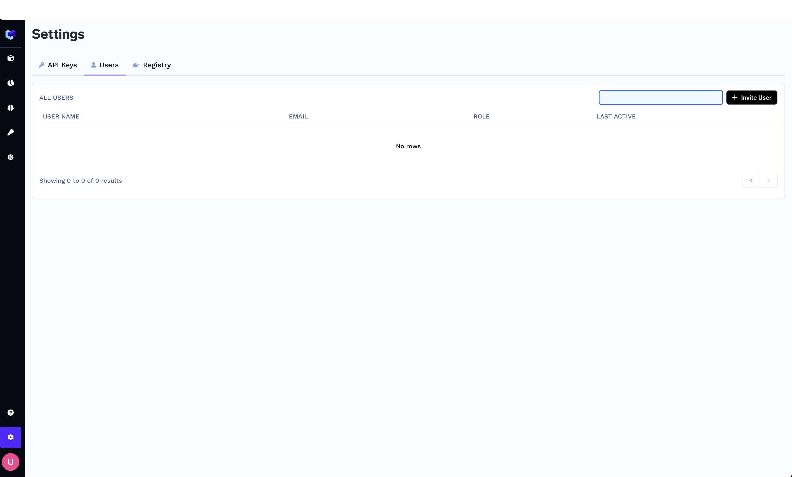
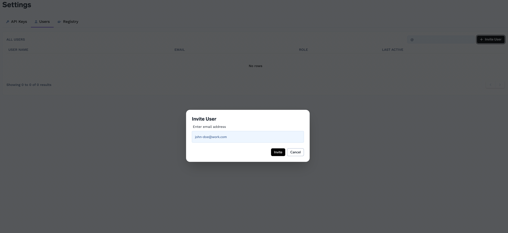
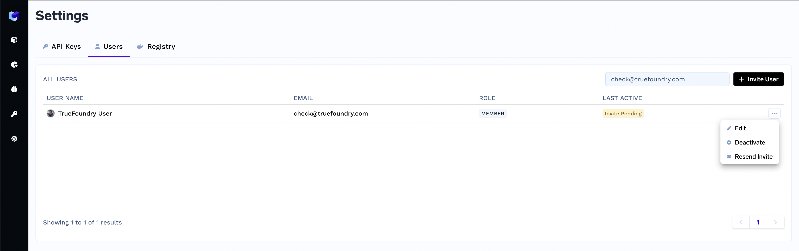
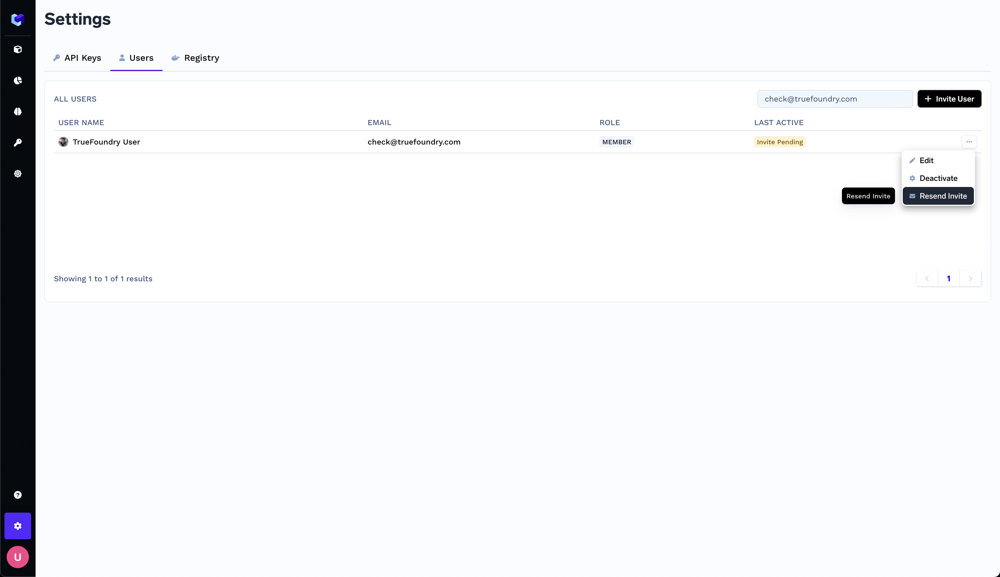
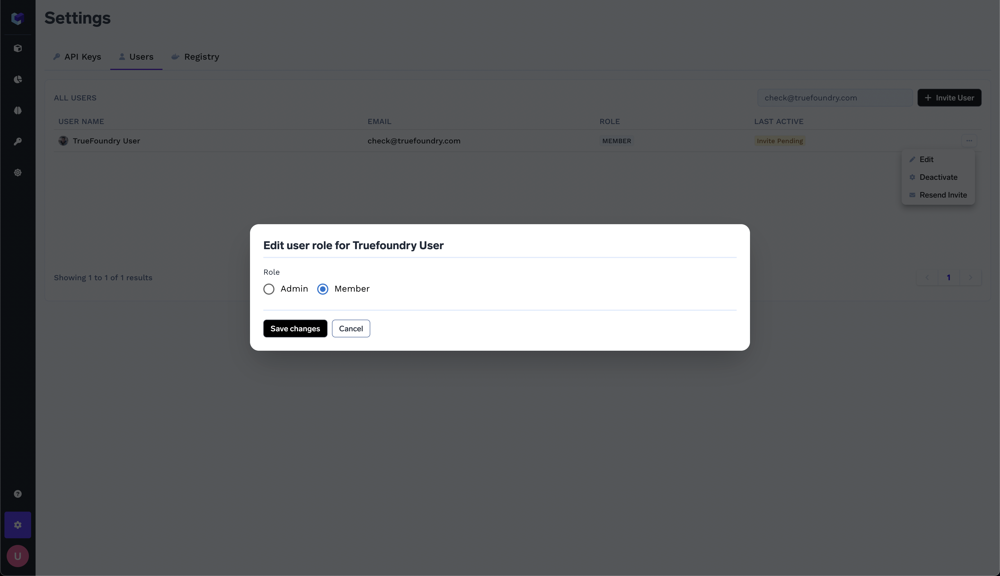
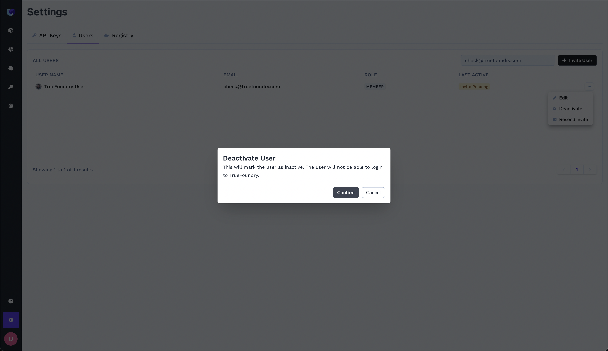

# Adding users to your truefoundry installation

Adding users to your truefoundry installation allows them to access the dashboard.
The dashboard contains an easy view each of the truefoundry components you are using, including experiment tracking, model deployments and monitoring.

- To add users, head to the Settings section, by click on the Gear icon from the bottom right.
- You should be able to see the `Users` section. Choose the section.

- On the right you will see an `Invite User` button. Click on the button.
- An `Invite User` modal will appear, where you can enter the email address of the user to be invited. 

- Upon entering the email id and clicking `Invite`, An email will be sent to user with the subject `You are invited to join Truefoundry`
- Once the email has been sent, you will see the user on the list with the status
`Invite Pending` in the Last Active column.

- If the user has not received the invite, you can click on `Resend Invite` from the menu against the user. 

- You can choose to promote a user to the admin role, by chooing the `Edit` option from the menu against the user. Change the users role to `Admin` and Save the changes. 

- If you wish to revoke access for any user, choose the option to `Deactivate` from the menu against the user and confirm your action.

