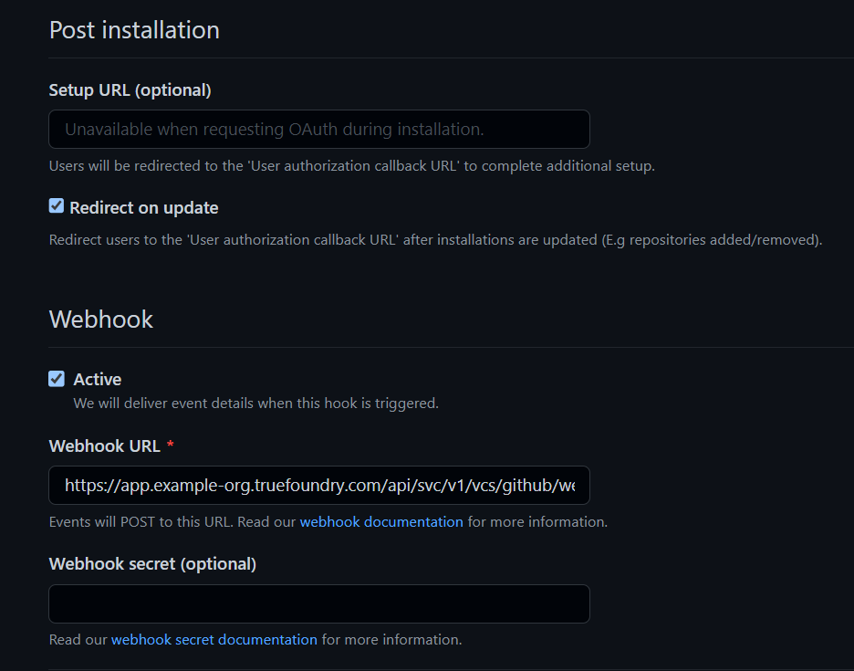
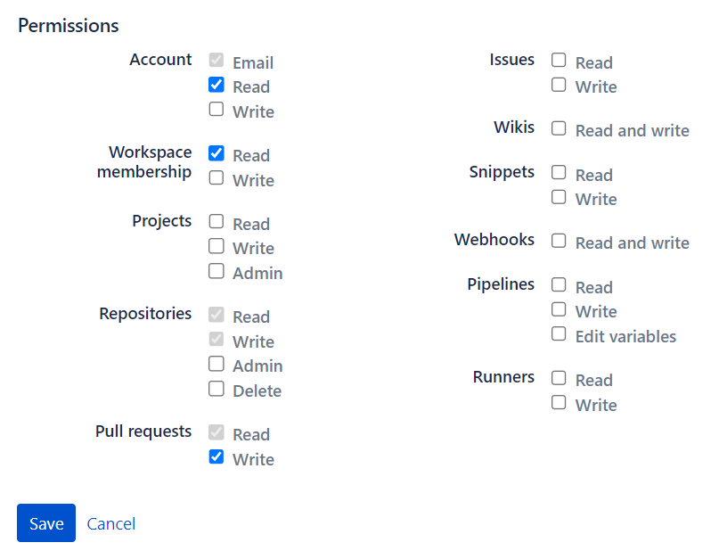
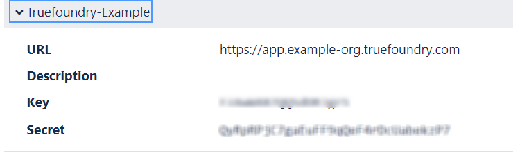

# Adding version control integration

Adding version control services like Github and Bitbucket to truefoundry installation allows a user to directly access public/private repositories of the linked account for deployment.
To allow these integrations in your app, following steps need to be followed.

## Github
To enable Github integration in your app, you need to create a github app using your github account. This github app can then be installed on the users's account through our platform.

Follow these steps to create the github app and integrate it with truefoundry:
- In Github, select your avatar (Your profile and settings) from the navigation bar at the top of the screen. If you want to create app for personal account, select Settings. If you want to create it for an organization, select Your organizations > Settings.
- On the sidebar, select Developer Settings.
- On the sidebar, select Github apps.
- Click the New Github App button and add the following settings:
    - GitHub App name : Custom
    - Homepage URL : https:// + $TFY_HOSTNAME
    
    - Identifying and authorizing users 
        - Callback URL : https:// + $TFY_HOSTNAME + /api/svc/v1/vcs/github/callback
        - Check : Expire user authorization tokens
        - Check : Request user authorization (OAuth) during installation
    
    - Post installation
        - Check : Redirect on update
    - Webhook
        - Check : Active
        - Webhook URL : https:// + $TFY_HOSTNAME + /api/svc/v1/vcs/github/webhook-callback
    
    - Permissions
        - Repository Permissions:
            - Administration: read and write
    
            - Commit statuses : read and write
            - Contents : read and write
    
            - Metadata : read-only
            - Pull request: read and write
            - Webhooks: rad and write
    
    - Where can this GitHub App be installed? : Any account
    
- Once the app is created, store the GitHub App name and App id.

- Navigate to Private Keys section and generate a private key. A PEM file containing private key will be downloaded.

- Base 64 encode the entire content of the file. Please make sure to omit any whitelines before or after the text. Store it as private_key.
- Set environment variables using the [docs](https://docs.truefoundry.com/documentation/deploy/concepts/env-variables) :
    - GITHUB_INSTALLATION_URL=https://github.com/apps/${app_name}/installations/new
    - GITHUB_PRIVATE_KEY=${private_key}
    - GITHUB_APP_ID=${app_id}

## Bitbucket
To enable Bitbucket integration in your app, you need to create a Bitbucket consumer using your bitbucket account. This consumer can then be added to the users's account through our platform.
Follow these steps to create the bitbucket app and integrate it with truefoundry:
- In Bitbucket, Select your avatar (Your profile and settings) from the navigation bar at the top of the screen. Under Recent workspaces, select a workspace.
- On the sidebar, select Settings to open the Workspace settings.
- On the sidebar, under Apps and features, select OAuth consumers.
- Click the Add consumer button. Add following settings:
    - Name : custom
    - Callback URL : https:// + $TFY_HOSTNAME + /api/svc/v1/vcs/bitbucket/callback
    - URL : https:// + $TFY_HOSTNAME

    

    - Permissions: 
        - Account : email, read
        - Repositories : read, write
        - Workspace membership : read
        - Pull requests : read, write

    

- Once the consumer is created, click on the consumer and store the key and secret.

Now, for allowing deployment of public bitbucket repositories, which do not even have the consumer added, we authorize using the App password, which need to be generated following way:
- Select your avatar (Your profile and settings) from the navigation bar at the top of the screen.
- Under Settings, select Personal settings.
- On the sidebar, select App passwords.
- Select Create app password. Add following settings:
    - Label : custom
    - Permissions : 
        - Account : email

- Create the password and store it.

- Now, base 64 encode `${username}:${password}` and store it as app_password. Here username is the bitbucket account's username, and password is the app-password generated above.
- Set environment variables using the [docs](https://docs.truefoundry.com/documentation/deploy/concepts/env-variables) :
    - BITBUCKET_CLIENT_ID=${key}
    - BITBUCKET_CLIENT_SECRET=${secret}
    - BITBUCKET_APP_PASSWORD=${app_password}
