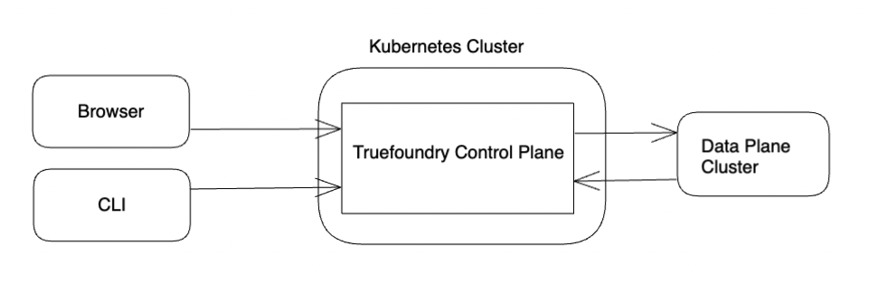
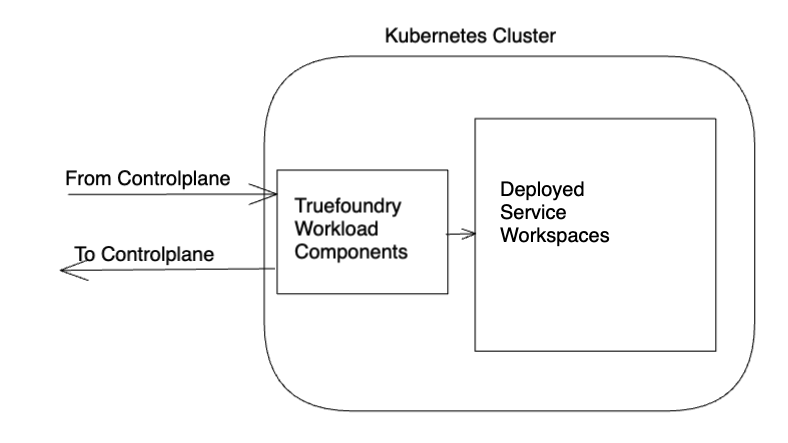
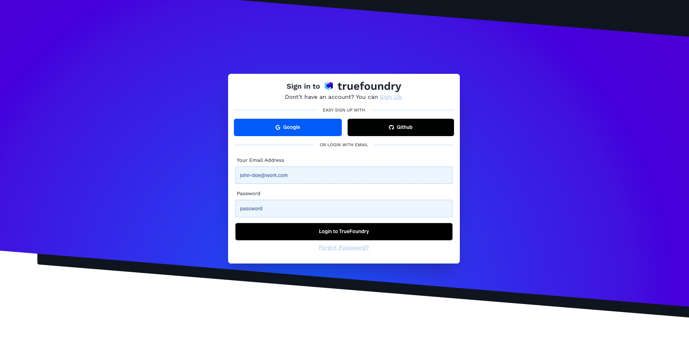

#  Truefoundry on your own cloud

Truefoundry can be installed onto your private cloud environment. We support deployments on AWS with support for other cloud providers coming soon. The guide will cover the installation with Helm charts. This is the recommended method of installation for your own cloud.

## Resources Required

- Truefoundry user credentials
- A Private Cloud Environment
- Permissions to create resources in that environment 

## Architecture

The below shows the resources that will be brought up to provide an installation that provides both experiment tracking and model deployment. The Truefoundry installation consists of 2 set of components. 

- The Truefoundry Helm Chart - This helm chart provides the installation of core components of truefoundry. This chart also acts as the control plane if model deployment is required. This is mandatory for all installations of truefoundry.



- The Truefoundry Workload Helm Chart - This chart is required to be installed only if model deployment functionality is required. This helm chart provisions the resources required for enabling model deployment on the cluster. You can attach multiple workload clusters to a single installation of Truefoundry.



## Installation

We explain below the steps to install truefoundry with support for both experiment tracking and model deployment on AWS. 

### Required Resources for production deployment

- S3 bucket for experiment tracking 
- S3 bucket for model deployment
- RDS instances with two PostgreSQL databases, one for experiment tracking and model deployment.

We provide the [terraform-aws-truefoundry](https://github.com/truefoundry/terraform-aws-truefoundry) terraform module to assist with the creation of these resources on AWS.

### Installation Steps

- Reach out to the Truefoundry team to create and share the required keys at abhishek@truefoundry.com
- Create the required buckets and DBs on your cloud environment. 
- Configure the truefoundry url and the workload url DNS records to point to the appropriate load balancer endpoints or IPs
- Install the `truefoundry` helm chart below using the following commands. This is required for all installations.
- (Optional) If you wish to use model deployment, Add a cluster from the Truefoundry dashboard. This will provide a truefoundry cluster token. With this token install the `tfy-workload` helm chart

The values files to be used in each case will be shared with you. They will require that you fill in the sections with the information.

#### Pre Installation

Make sure that [helm](https://helm.sh/docs/intro/install/) is installed.

#### Helm Repository Addition

```
helm repo add truefoundry https://truefoundry.github.io/charts
helm repo update
helm repo list
```

This will now show the truefoundry repository as an available helm repository.

#### Helm Chart Installation

Once the Helm repository is added, you can install the individual components based on the features required. The values file for each will require additional values like imagePullCredentials that will be provided by the truefoundry team when an installation is requested. 

- Truefoundry

The truefoundry helm chart provisions the core components of truefoundry. This is mandatory for all private installations of the same. 

```
helm upgrade --install truefoundry truefoundry/truefoundry
```

- Truefoundry Workload

The truefoundry workload cluster will contain the workspaces and services that are created by your users. Do ensure that the kubernetes cluster where these are installed has sufficient resources for the same.

```
helm upgrade --install tfy-workload truefoundry/tfy-workload
```

The various options and values that are available for each are described in the helm charts. 


#### Verify Installation

You can verify that your installation is up and running by heading to the truefoundry url that you will configure as part of the setup. You should be greeted with the screen below

