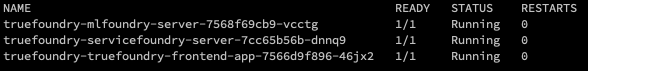

# Local Installation

To perform a local install Truefoundry in your own cloud for Non Production use, please make sure you have the following things ready as 
mentioned in the [requirements](./requirements.md) page. 

1. Kubernetes Cluster
2. An Ingress controller setup to access components in the cluster
3. Information from Truefoundry Team
   1. Tenant ID
   2. Password of the initial user
   3. Image Pull Secret to pull the docker images

This guide will walk you through the process of setting up Truefoundry. 

## Install Truefoundry Helm-Charts

Make sure that [helm](https://helm.sh/docs/intro/install/) is installed.

### Add Truefoundry Helm Repo

```
helm repo add truefoundry https://truefoundry.github.io/charts
helm repo update
helm repo list
```

### Install Truefoundry helm chart

Create a values file (tfy.yaml) as shown below. Fill up the values as provided by Truefoundry team
and what is relevant for your cluster. You can see the details values file [here](You can see the complete values file [here](https://github.com/truefoundry/charts/blob/main/charts/truefoundry/values.yaml).

```
global:
  # The below are installation secrets that will be provided as is.
  # These are customised for your account. Please use the provided values as
  # is.
  imagePullCredentials: "<to_be_provided_by_truefoundry>"
  tenantName: "<to_be_provided_by_truefoundry>"

##########################
# Settings specific to dashboard app
truefoundry-frontend-app:
  enabled: true
  replicaCount: 1
  # We support both generic ingress controller as well Istio Virtual Service. You
  # can configure either of them.
  ingress:
    enabled: false
    annotations: {}
    labels: {}
    ingressClassName: istio
    tls: []
    hosts: []
  istio:
    virtualservice:
      enabled: false
      annotations: {}
      gateways: []
      hosts: []
  resources:
    limits:
      memory: 1Gi

#############################
# Settings specific to mlfoundry.
mlfoundry-server:
  enabled: true
  replicaCount: 1
  env:
    # Database config for mlfoundry
    DB_USERNAME: "truefoundry"
    DB_PASSWORD: "test123"
    DB_NAME: "mlfoundry"
    DB_HOST: "truefoundry-postgresql.truefoundry.svc.cluster.local"
    DB_PORT: 5432
    # S3 bucket name mandatory
    S3_BUCKET_NAME: mlf-server-bucket
    # Configure with externally reachable minio server url if minio is required
    S3_ENDPOINT_URL: https://truefoundry-minio.organisation.com:9000
    BUCKET_ACCESS_KEY_ID: truefoundryKey
    BUCKET_SECRET_ACCESS_KEY: truefoundrySecret
  serviceAccount:
    annotations:
      # Provide permission to s3 using role_arn or anything compatible
      eks.amazonaws.com/role-arn: <role_arn>

#######################
# Settings specific to servicefoundry.
servicefoundry-server:
  enabled: true
  replicaCount: 1
  env:
    # API KEY recieved from truefoundry for servicefoundry
    SVC_FOUNDRY_SERVICE_API_KEY: <to_be_provided_by_truefoundry>
    # Database config mandatory
    DB_USERNAME: "truefoundry"
    DB_PASSWORD: "test123"
    DB_NAME: "svcfoundry"
    DB_HOST: "truefoundry-postgresql.truefoundry.svc.cluster.local"
    DB_PORT: 5432
    # S3 bucket name mandatory
    S3_BUCKET_NAME: s3://svcf-server-bucket
    # Configure with externally reachable minio server url if minio is required
    S3_ENDPOINT_URL: https://truefoundry-minio.organisation.com:9000
    AWS_ACCESS_KEY_ID: truefoundryKey
    AWS_SECRET_ACCESS_KEY: truefoundrySecret
    # This is the externally reachable url configured above in the
    # ingress section of truefoundry-frontend-app. Without this value, servicefoundry
    # will not work.
    CONTROL_PLANE_URL: "https://truefoundry.organization.com"
  serviceAccount:
    annotations:
      # Provide permission to s3 using role_arn or anything compatible
      eks.amazonaws.com/role-arn: <role_arn>

#############################
# Settings specific to sfy-manifest-service.
sfy-manifest-service:
  enabled: false
  replicaCount: 1
  env:
    PORT: 8080
    SFY_SERVER_URL: <server_url>
    SFY_API_KEY: <api_key>
  serviceAccount:
    annotations:
      # Provide permission to read the sfy api key from ssm
      eks.amazonaws.com/role-arn: <role_arn>

#############################
# To further configure the local postgres installation use the following section.
# During cleanup, make sure to remove any stray pvc that might be created.
postgresql:
  enabled: true
  auth:
    # The following is an example set of configuration provided. 
    # The same host will contain 2 databases to bring up each server
    username: truefoundry
    password: test123
  primary:
    initdb:
      scripts:
        intidb.sql: |
            CREATE DATABASE mlfoundry;
            CREATE DATABASE svcfoundry;
            GRANT ALL PRIVILEGES ON DATABASE mlfoundry TO truefoundry;
            GRANT ALL PRIVILEGES ON DATABASE svcfoundry TO truefoundry;

# To further configure the local minio installation use the following section.
# The minio installation requires an ingress to function from outside the kubernetes
# cluster, for eg. from the cli or a different kubernetes cluster
minio:
  enabled: true
  mode: standalone
  rootUser: truefoundry
  rootPassword: test123456
  persistence:
    enabled: false 
  users:
    - accessKey: truefoundryKey
      secretKey: truefoundrySecret
      policy: readwrite
  buckets:
    - name: mlf-server-bucket
      policy: upload
      purge: false
    - name: svcf-server-bucket
      policy: upload
      purge: false
  resources:
    requests:
      memory: 1Gi
  ingress:
    enabled: true
    ingressClassName: istio
    hosts:
    - "https://truefoundry-minio.organisation.com"
```

Install the helm chart with this values file:

```
helm upgrade --install truefoundry truefoundry/truefoundry -f tfy.yaml --wait --create-namespace --namespace truefoundry
```

The above command can take a few seconds since it will wait for all the pods to come up. The default installation should install the components to the truefoundry namepsace. Once its done, check
the final status using the following command:

```
kubectl get pods -l 'app.kubernetes.io/name in (truefoundry-frontend-app,servicefoundry-server,mlfoundry-server)' -n truefoundry
```

You should see pods for each of the services truefoundry-frontend-app, servicefoundry-server, mlfoundry-server in `Running` condition



#### Verify Installation

If you have provided an ingress in tfy.yaml, you should be able to access truefoundry at the link provided in the 
hosts section, else you can always port-forward the service truefoundry frontend app and check.

```
kubectl port-forward svc/truefoundry-truefoundry-frontend-app 8080:5000 -n truefoundry
```

You should be greeted with a screen like below when you visit `https://localhost:8080` :


You can login using the admin username and password provided to you. 

Please note at this point you can use MLFoundry and ML-Monitoring, but additional work is needed for 
getting started with ServiceFoundry. We need to provide the workload cluster to ServiceFoundry so that it can deploy
the workloads there. 


