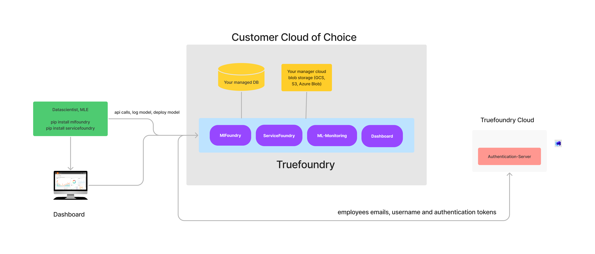

# Overview

Truefoundry can be installed onto your own AWS, GCP or Azure account. As of now, we have the docs for installing it on AWS with support for
other cloud providers coming soon. The infrastructure can be brought up with a combination of Kubernetes and Terraform. By deploying it on your own cloud,
none of the data ever leaves your cloud and also get support from Truefoundry engineering team in case of any issues. 

## Architecture Overview

Truefoundry comprises of the following functionalities:

### Experiment Tracking and ML Metadata Store (MLFoundry)

MlFoundry is used to log models, datasets, metrics, params related to model training and helps maintain lineage between the runs and artifacts. 

### ML Training and Inference Deployment (ServiceFoundry)

ServiceFoundry helps data scientists and machine learning engineers to deploy jobs and services on Kubernetes. It also provides an internal developer 
platform to view all the deployed services along with the cost and manage permission and access control. 

### ML Monitoring (ML-Monitoring) - Coming Soon

This component enables monitoring of ML Models and view model/feature distributions and drifts. 

### Truefoundry Dashboard:

This is a dashboard which helps you view the data from MlFoundry, Servicefoundry and ML-Monitoring in one place. 

### Client Libraries:

We have two client libraries for datascientists, engineers and devops to interact with the services mentioned above. The two libraries are:

1. [mlfoundry](https://pypi.org/project/mlfoundry/) (`pip install mlfoundry`)
2. [servicefoundry](https://pypi.org/project/servicefoundry/) (`pip install servicefoundry`)

### Central Authentication Server

Truefoundry team maintains a central authentication server for users and license management to which all the above components talk.

All the above functionalities can be installed independently or together depending on your requirements.

The guide will cover the installation with Helm charts. This is the recommended method of installation for your own cloud.
