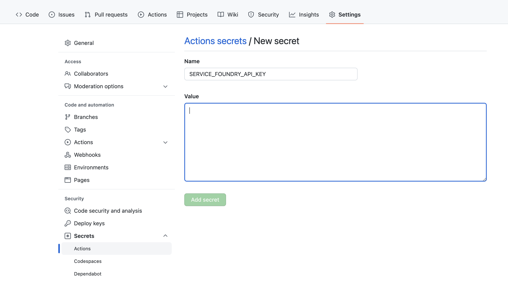

# Integrate servicefoundry in a CI/CD pipeline

## Introduction
Deployments using `servicefoundry` can be seamlessly integrated with any CI/CD pipeline solutions like Github Actions, Jenkins etc. The following steps show you how to setup Github Actions to automatically deploy your application to TrueFoundry.

## Before you start
Make sure the following steps have been completed before moving ahead:
- [Install servicefoundry and create a worksapce](https://docs.truefoundry.com/servicefoundry/quick-start#install-servicefoundry-client-library)
- Create a Github repo with your service code including `servicefoundry.yaml`. If you are not familiar with creating a TrueFoundry service, check [this quick guide](../quickstart/fastapi-quickstart.md) out.


## Steps
- Get your API key from the [dashboard](https://app.truefoundry.com/settings).
- Add the API key to the Github repository as a secret with key `SERVICE_FOUNDRY_API_KEY`.
  


- In your repository, create a folder for Github Actions
  ```bash
  mkdir -p .github/workflows
  ```
- Create a file called `sfy-deploy.yaml` in this folder and paste the below content:
  ```bash
  name: sfy deploy
  on:
    push:
      branches:
      - main
  jobs:
    deploy:
      runs-on: ubuntu-latest
      steps:
      - run: echo "Deploying ${{ github.ref }} to servicefoundry"
      - name: Install sfy
        run: pip install servicefoundry
      - name: Check out repository code
        uses: actions/checkout@v3
      - name: Deploy
        run: sfy deploy
        env:
          SERVICE_FOUNDRY_API_KEY: ${{ secrets.SERVICE_FOUNDRY_API_KEY }}
  ```
- Commit this file to `main`. This will trigger the pipeline and deploy the code on `main` to TrueFoundry
