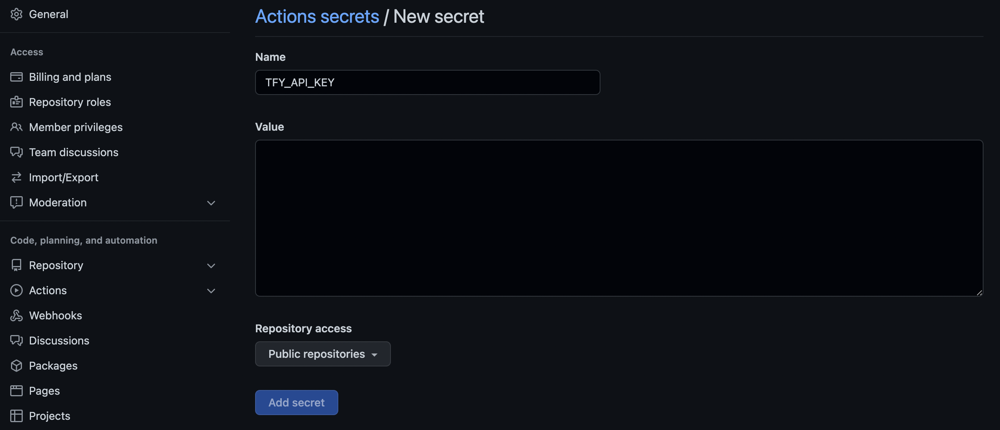

# Integrate servicefoundry in a CI/CD pipeline

## Introduction
Deployments using `servicefoundry` can be seamlessly integrated with any CI/CD pipeline solutions like GitHub Actions, Jenkins etc.<br>
The following steps show you how to setup GitHub Actions to automatically deploy your application to TrueFoundry.

## Before you start
Make sure the following steps have been completed before moving ahead:
- [Install servicefoundry and create a workspace](https://docs.truefoundry.com/servicefoundry/quick-start#install-servicefoundry-client-library)
- Create a GitHub repo with your service code including `servicefoundry.yaml`. If you are not familiar with creating a TrueFoundry service, check [this quick guide](../streamlit.md) out.


## Steps
- Get your API key from the [dashboard](https://app.truefoundry.com/settings).
- Add the API key to the [GitHub Secrets](https://docs.github.com/en/actions/security-guides/encrypted-secrets) with the key `TFY_API_KEY`.
  


- In your repository, create a folder for GitHub Actions
  ```bash
  mkdir -p .github/workflows
  ```
- Create a file called `ci-cd-automation.yaml` in this folder and paste the below content:
  ```yml
  # Replace `<your-workspace-fqn>` with the FQN of the workspace where
  # you want to deploy your code.
  name: sfy deploy
  on:
    push:
      branches:
      - main
  jobs:
    deploy:
      runs-on: ubuntu-latest
      env:
        TFY_API_KEY: ${{ secrets.TFY_API_KEY }}
      steps:
      - uses: actions/checkout@v3
      - name: Set up python
        uses: actions/setup-python@v3
        with:
          python-version: 3.9

      - name: Install servicefoundry library
        run: pip install servicefoundry

      - name: Deploy to servicefoundry
        run: sfy deploy --file servicefoundry.yaml --workspace-fqn <your-workspace-fqn>
  ```

Your directory structure should look something like this:
```
.
├── .github/
│   └── workflows/
│       └── ci-cd-automation.yaml
├── main.py
├── requirements.txt
└── servicefoundry.yaml
```

- Commit this file to the `main`. This will trigger the pipeline and deploy the code on `main` to TrueFoundry

You can find the code for a simple FastAPI app that is deployed to TrueFoundry using GitHub Actions [here](https://github.com/truefoundry/truefoundry-examples/tree/main/deployment/ci-cd-automation).
