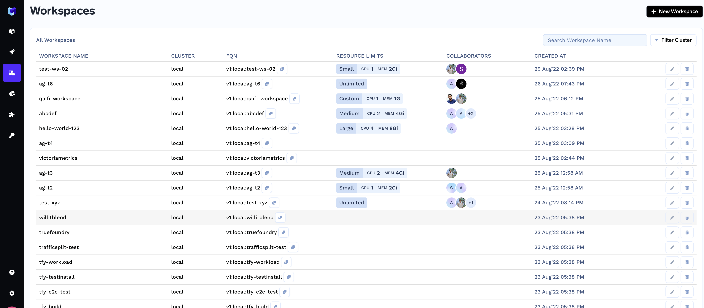

# Cluster and Workspace

A cluster is a group of machines grouped together on which we can deploy jobs and services. 
Whenever we want to deploy let's say a service, a cluster orchestrator will find a machine that has resources left to run my service and 
will deploy the service there. Kubernetes is one of the most popular cluster orchestrators that automates orchestration of workloads among machines. Other examples of 
orchestrators are Amazon ECS, Hashicorp Nomad. 

A cluster can be divided into workspaces each of which can have multiple services. 

> **_NOTE:_** A Workspace is a way to group applications that are somewhat similar - either they are handled by the same team, or belong to an environment like dev, staging, production. Each workspace can have multiple applications. 

In Truefoundry, workspace also serves as the minimum unit of permission and access control which means that we can add users to a workspace and they will
have access to everything inside the workspace. Workspaces can also be resource bound as in they have a max limit for CPU, memory usage and hence cost. 

> In the Kubernetes world, workspace maps to one namespace in the Kubernetes cluster. 

In many cases, the devops / infra team provisions a cluster and then creates workspaces. They will then assign different workspaces to different teams based
on their requirements. 

## Viewing Workspaces

You can view all the workspaces that you have access to on the Workspaces tab. You can add or edit workspace, change its resource constraints and add more team members
as collaborators. 

## Copy Workspace FQN (Fully Qualified Name)

A workspace FQN helps identify a workspace uniquely in Truefoundry. You will need it for deploying your services and jobs to specify where you want to deploy. 

A workspace FQN looks something like: `tfy:cluster-eu-west-1:test-ws-02`

`tfy` is the tenant / organization name.
`cluster-eu-west-1` is the region name.
`test-ws-02` is the workspace name. 

You can copy it from the FQN column in the workspaces page.

