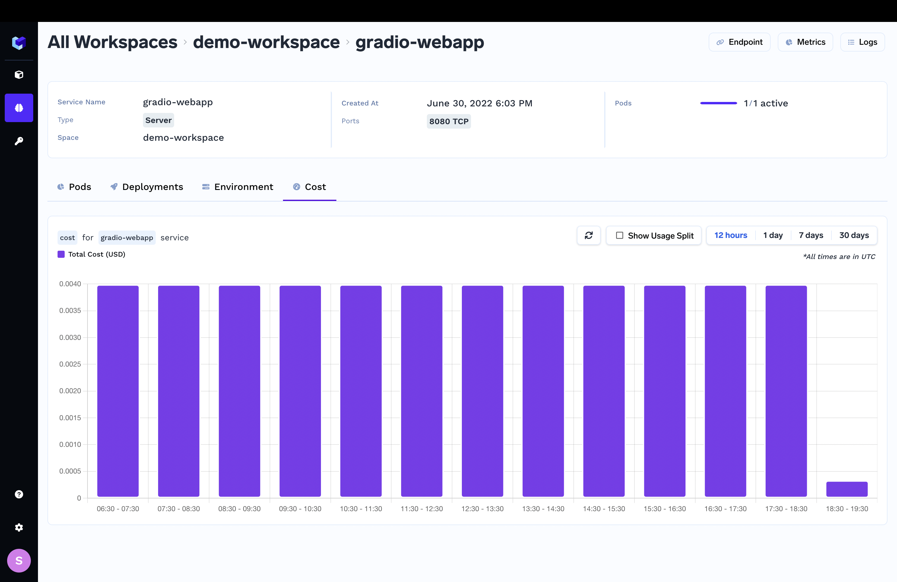

# Cost of a service

You pay for a service deployed on TrueFoundry based off how much CPU and memory the service is consuming.  You can find out how much a service is costing from the TrueFoundry dashboard.

1. From the [workspaces page](https://app.truefoundry.com/workspace), click on the service you want to see the cost for.
2. Go to the cost tab to see hourly, daily and weekly usages. You can also see the split of consumption based off memory and CPU usage.

