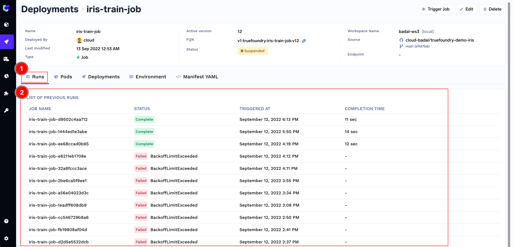
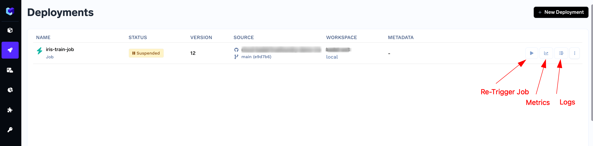
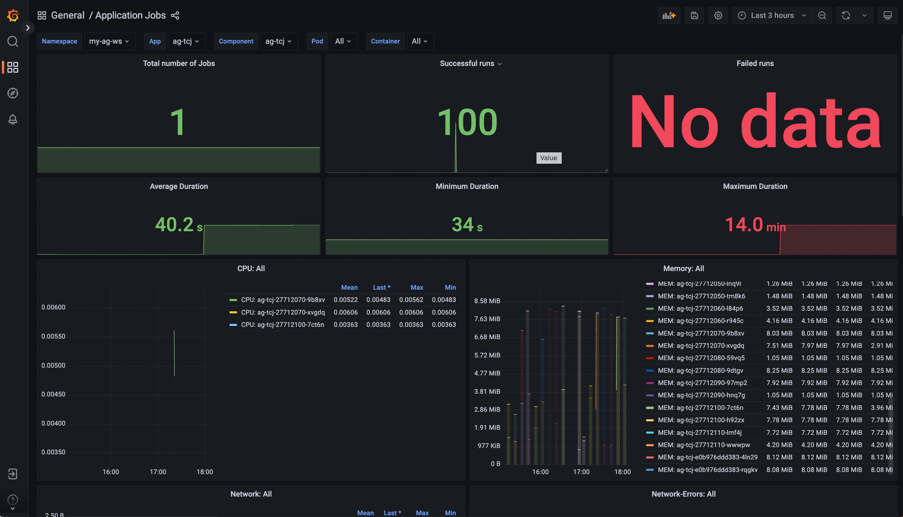

# Monitor and Debug Job Runs

## Runs History

We can check the past and ongoing runs of a Job from the Job Details UI.

You can find the link to the Job Details from the Truefoundry dashboard on [Deployments](https://app.truefoundry.com/applications) page. 

## Metrics and Logs

Truefoundry enables you to monitor your deployed jobs and view the Metrics and Logs on a [Grafana](https://grafana.com/oss/grafana/) dashboard.

You can find the link to the Job Details from the Truefoundry dashboard on [Deployments](https://app.truefoundry.com/applications) page. 

Here is a dashboard of a deployed job.

You can monitor the following metrics in the dashboard:
* **Total number of Jobs**: Total number of runs for a job
* **Successful runs**: Count of the successful runs
* **Failed runs**: Count of the failed runs
* **Average Duration**: Average Duration of run for the job
* **Minimum Duration** : Minimum Duration of a run for the job
* **Maximum Duration**: Maximum Duration of a run for the job
* **CPU**: CPU utilization by the job
* **Memory**: Memory consumed by the Job in MiB
* **Network**: Volume of data transmitted and received by the service.
* **Disk Usage**: Rate of read and write by the job on disk
* **Logs**: View Logs of the jobs for different runs

