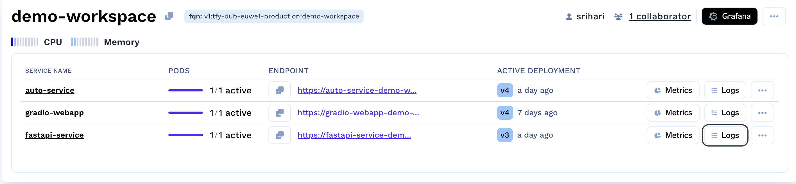
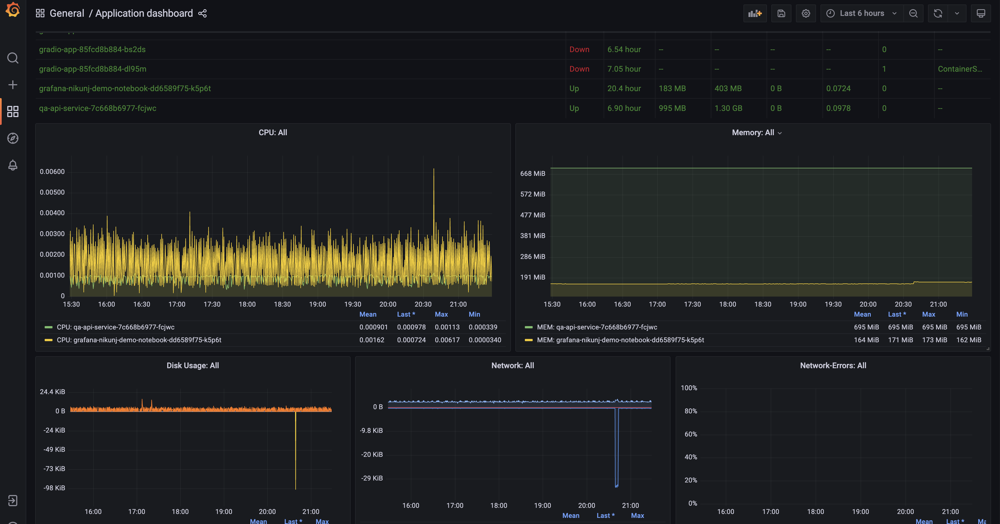
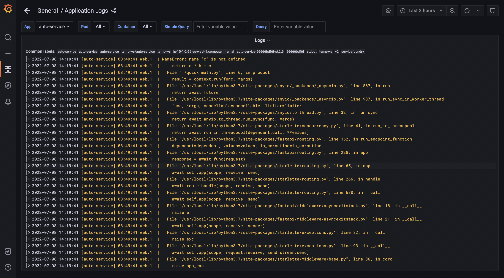

# Monitoring your services

All service deployments come with Grafana dashboards that provide system metrics, system logs and application logs.

From the dashboard, you can access the metrics and logs for each your services:

The `Grafana` link at the workspace level provides system metrics and logs for the entire workspace.

At the service level, `Metrics` will take you to the Grafana dashboard that contains system metrics like CPU, memory and disk usage for that service.

`Logs` provide both system and application logs. This is useful for debugging when your service is not working as expected.

You can also create your own custom dashboard by collating various metrics.