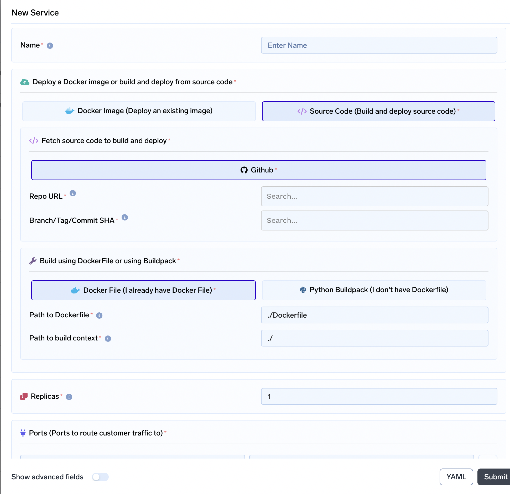
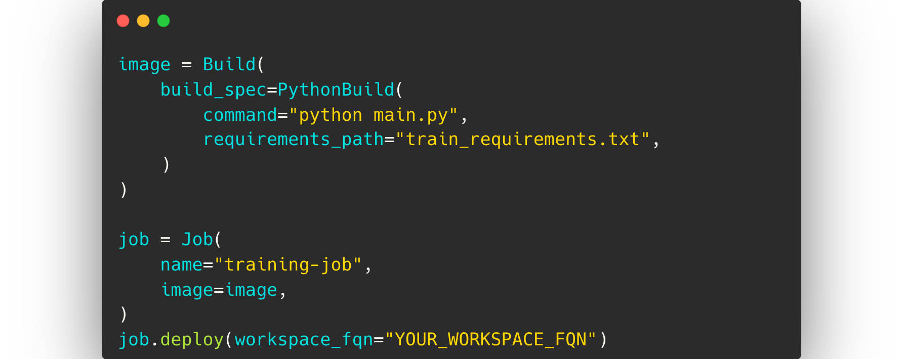
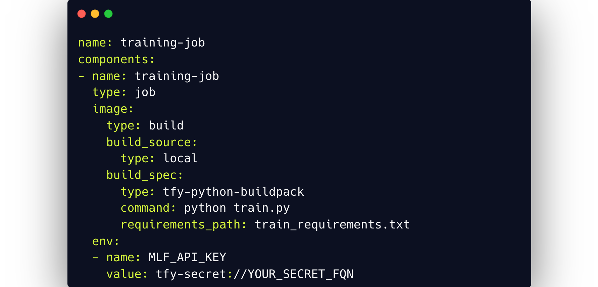

# Overview

TrueFoundry lets you deploy your machine learning models as services with minimal effort. This deployment comes with best practices like monitoring, auto-scaling, versioning & reproducibility out of the box.

We provide ML Platform on top of Kubernetes which abstracts out the complexities of Kubernetes for data scientists and ML Engineers. It also helps data scientists and ML engineers move fast and independently without active intervention from Devops and Infra teams, while also making sure that Infra teams can overlay policies to ensure security and cost control. 

[`servicefoundry`](https://pypi.org/project/servicefoundry/) is the client-side library from TrueFoundry used to deploy services. It is available both as a command line interface (CLI) and a Python module that you can use to deploy models without having the complete understanding of Kubernetes. Truefoundry support deploying the same model via three ways:

## UI 
This is the most intuitive and probably the fastest way to get started. This offern direct integration with Github, Bitbucket and Gitlab so that you can deploy from your Git repositories in one click. We can also see the YAML and the corresponding Python code from the UI. 

## Python Code
Python code is generally useful when we want to deploy from Jupyter Notebooks and this is what data scientists are most comfortable with. 

## YAML
This is the preferred way to deploy in CI/CD systems and provides an easy to understand declarative spec of the deployment. 

