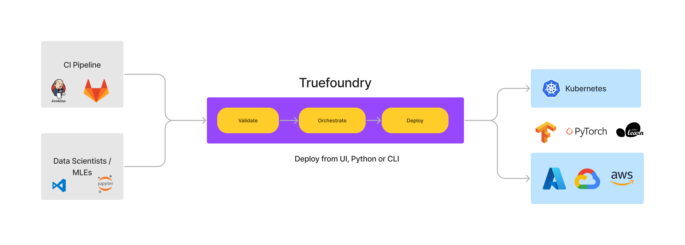

# Overview

TrueFoundry lets you deploy your machine learning models as services with minimal effort. This deployment comes with best practices like monitoring, auto-scaling, versioning & reproducibility out of the box.

We provide ML Platform on top of Kubernetes which abstracts out the complexities of Kubernetes for data scientists and ML Engineers. It also helps data scientists and ML engineers move fast and independently without active intervention from Devops and Infra teams, while also making sure that Infra teams can overlay policies to ensure security and cost control. 

[`servicefoundry`](https://pypi.org/project/servicefoundry/) is the client-side library from TrueFoundry used to deploy services. It is available both as a command line interface (CLI) and a Python module that you can use to deploy models directly from training notebooks like Jupyter.

