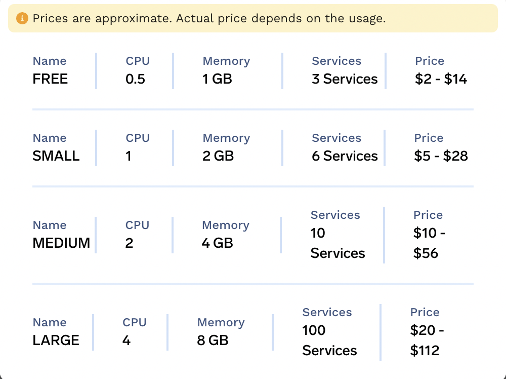

# Quick Start

## Signup on TrueFoundry

Sign up on [TrueFoundry](https://app.truefoundry.com/signup) using email, Google account or Github account.

## Install ServiceFoundry client library

On your machine, run (preferably within a virtual environment or conda environment):
```
pip install servicefoundry
```

## Login from CLI

From the CLI, the following and follow the link to authenticate:

```
servicefoundry login
```

Output:
```commandline
Login Code: XXXXXX

Waiting for authentication. Go to the following url to complete the authentication:
https://app.truefoundry.com/authorize/device?userCode=XXXXXX

Login Successful!

Session file stored at /Users/user/.truefoundry
You are logged in as 'user' with email 'user@xxx.xxx'
```

## Create a workspace

To deploy services using TrueFoundry, you need to first create a workspace. A workspace is simply a collection of services that have the same set of permissions on them.

1. To create a workspace, go to the [workspaces page on the TrueFoundry dashboard](https://app.truefoundry.com/workspace) and click on `Create Workspace`.


2. Give a name for your workspace and choose a tier. You can choose a tier based on your resource requirements out of the four options. If you're unsure, start with a free tier and you can later upgrade your workspace.




