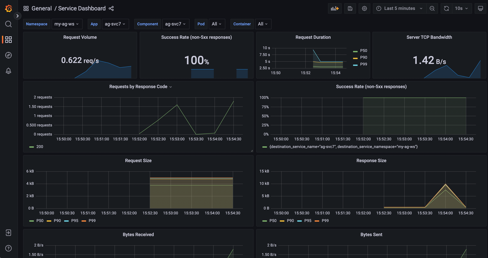

# Monitoring the Deployed Services and Metrics

Truefoundry enables you to monitor your deployed services and view the `metrics` on a `grafana dashboard`.

You can find the link to the dashboard from the truefoundry dashboard on deployments page.

[//]: # (shall we add image of deployments page here)
Here is a dashboard of a deployed service.

You can monitor the following metrics in the dashboard:
* **Request Volume** : Number of request received by the service per second. 
* **Success Rate**:  Percentage of requests that returned non-5xx responses.
* **Request Duration**: This represents the latency of your service for different percentiles of total requests like P50, P90 and P99. 
* **Server TCP Bandwidth**: Throughput on the server
* **Requests by Response Code**: Number of requests received per second for each response code, like 200, 401 etc.
* **Success**: The piece of data on which machine learning models are trained.
* **Request Size**: This represents size of request for different percentiles of total requests like P50, P90, P95 and P99. 
* **Response Size**: This represents size of response for different percentiles of total requests like P50, P90, P95 and P99. 
* **Bytes Received**: The volume of data received by the service.
* **Bytes Sent**: The volume of data sent by the service.
* **CPU**: CPU usage by the service
* **Memory**: Memory consumed by the service in MiB
* **Network**: Volume of data transmitted and received by the service.
* **Disk Usage**: Rate of read and write by the service on disk
* **Logs**: View Logs of the service.

[//]: # (Unit of cpu usage)
[//]: # (add section for network error)