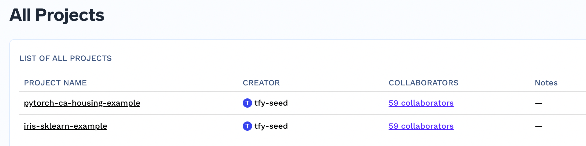
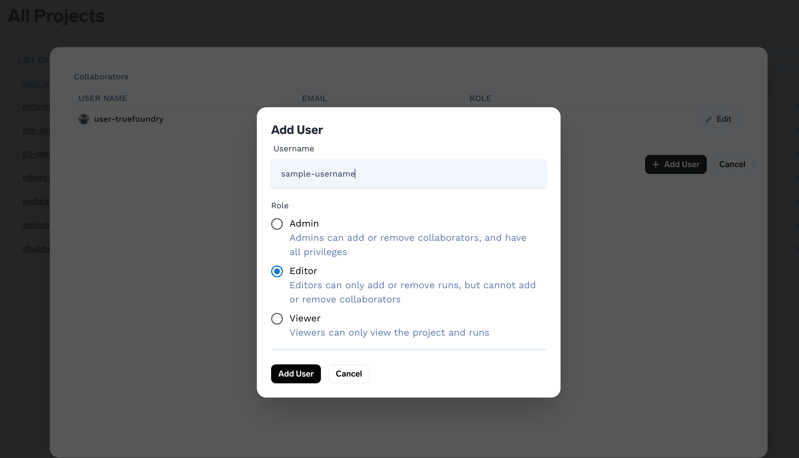

# Adding a collaborator

The users with ADMIN access can see other collaborators, add/remove collaborators.

These operations can be performed from the dashboard directly. 

Admin can add/remove collaborator by clicking on add-user button.

