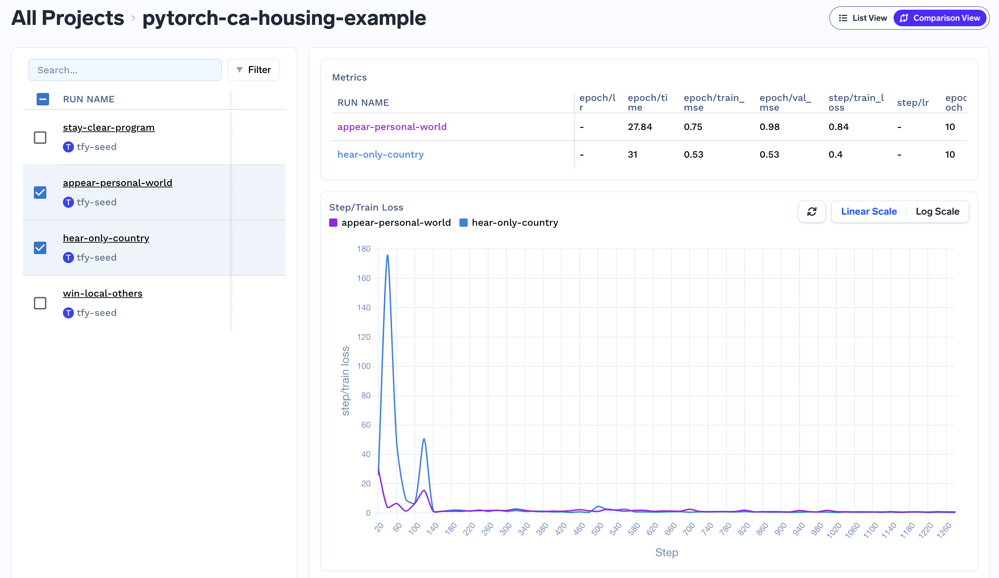

# Compare Metrics

You can compare different runs under the same project on the basis of different metrics.

Switch from run view to comparison view by clicking on the option on top-right corner of the screen.

You can select the runs you want to compare by selecting or deselecting the checkbox.