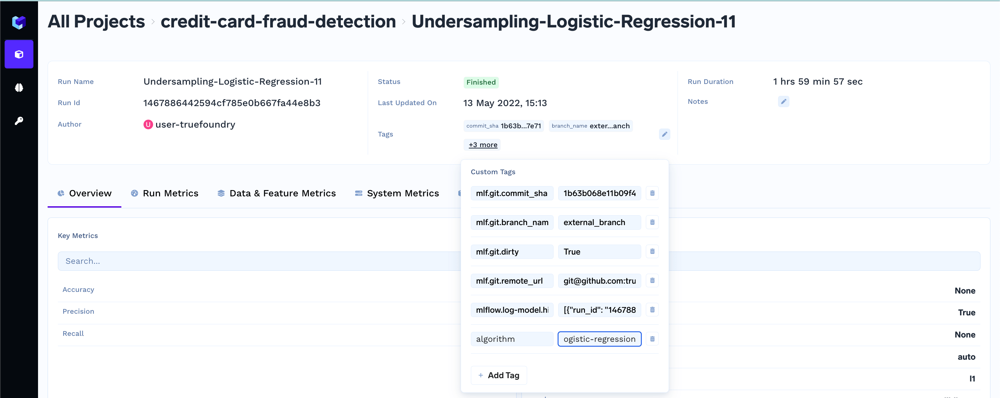
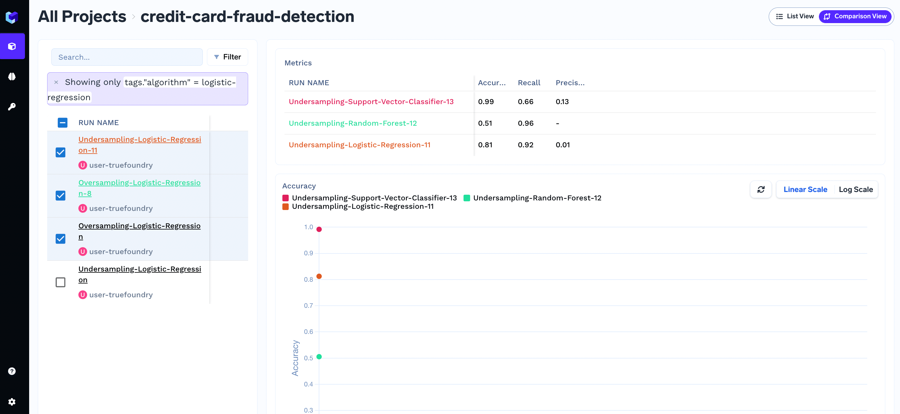

# Organize runs-sets using tags

You can add tags to runs and then organize the runs (within a project) in different run-sets on the basis of these tags for hyper-parameter tuning.

For example, if you want to organize run-sets based upon the algorithm used. 

First add a tag with the key as algorithm to the runs as explained in the [section](../log-data/add-tags.md)

Now you can add a filter on the basis of tag and compare the runs in our run-set easily in the comparison view.

