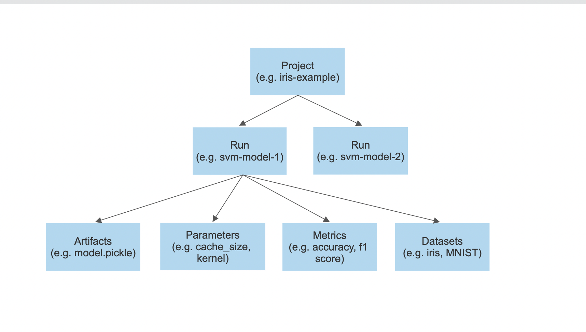

# Concepts

The entities defined in MLFoundry can be understood from the diagram below.

* **Project**: A project is the basic component of MLFoundry which embodies the high-level goal of the experiments, like "predicting the sentiment of product reviews". Access controls and collaboration with team-mates happens on a project level in MLFoundry.
* **Run** :  A single run represents a single experiment within a project.
* **Artifacts**: An artifact can be any file or directory.
* **Parameters**: These are the independent for a run to control the model training process. (or the hyperparameters)
* **Metric**: Metrics are values that help you to evaluate and compare different runs.
* **Dataset**: The piece of data on which machine learning models are trained.
 

