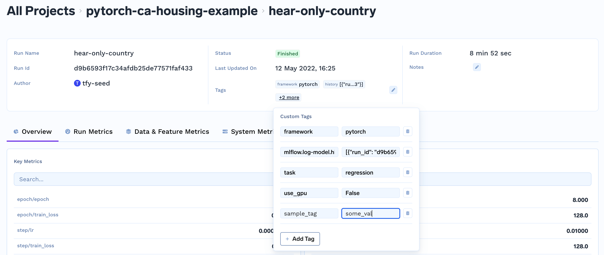

### Add Tags

Tags are labels for a run. A tag is represented by a string tag name and value.

#### Adding tags programmatically
```python
import mlfoundry

client = mlfoundry.get_client()
run = client.create_run(project_name="iris-demo", run_name="svm-model")

run.set_tags({"env": "development", "task": "classification"})
run.end()
```

#### Adding tags with UI
You can view the tags from the dashboard and also create new tags.




#### How can I programmatically fetch the tags for a run?

You can use the `get_tags` method. It returns a dictionary.

```python
import mlfoundry

client = mlfoundry.get_client()
run = client.get_run("run-id-of-the-run")

print(run.get_tags())
```
