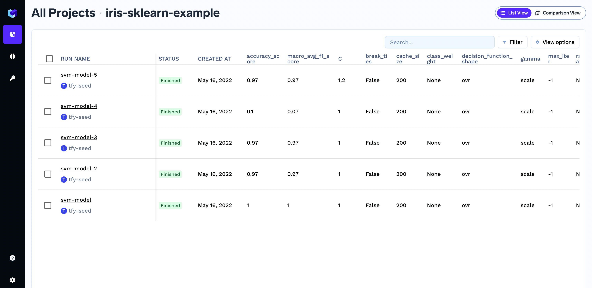

# Creating a run

A run is an entity that represents a single experiment. Create a run at the beginning of your script or notebook to start capturing system metrics.

```python
import mlfoundry

client = mlfoundry.get_client()
run = client.create_run(project_name="iris-demo", run_name="svm-model")
# Your code here.
run.end()
```
You can organize multiple runs under a single project. For example, the run `svm-model` will be created under the project `iris-sklearn-example`.

You can view these runs in the MLFoundry dashboard.



## FAQs
#### What is a project?

A project embodies the high-level goal of the experiments, like "predicting the sentiment of product reviews". To reach the goal, you can experiment with different machine learning algorithms with different parameters. A single run represents a single experiment. MLFoundry helps you organize these runs and find the best-performing ones under a project.

#### How can I create a project?

A project is automatically created when you call the `create_run` method. A project is identified by it's owner and name.

#### Can anyone create a run under my project?

No. MLFoundry provides project-level authorization. If someone in your team wants to view or create a run under your project, you need to add them as a collaborator to your project.

#### How can I create a run under a project owned by someone else?

You can use the owner argument to pass the user's username who owns the project. You should at least have `WRITE` permission for the project.

```python
run = client.create_run(
    project_name="iris-demo",
    run_name="svm-model",
    owner="bob",
)
# Your code here.
run.end()
```

#### Can I use runs as a context manager?

Yes, we can use runs as a context manager. A run will be automatically ended after the execution exits the `with` block.

```python
run = client.create_run(project_name="iris-demo", run_name="svm-model")
with run:
    # Your code here.
    ...

# No need to call run.end()
```

#### Are run names unique?

Yes. run names under a project are unique. If a run name already exists, we add a suffix to make it unique.
If you do not pass a run name while creating a run, we generate a random name.

```python
import mlfoundry

client = mlfoundry.get_client()
run = client.create_run(project_name="iris-demo")

print(run.run_name)
run.end()
```

#### How runs are identified?

Runs are identified by by their `id`.

```python
import mlfoundry

client = mlfoundry.get_client()
run = client.create_run(project_name="iris-demo")

print(run.run_id)
run.end()
```