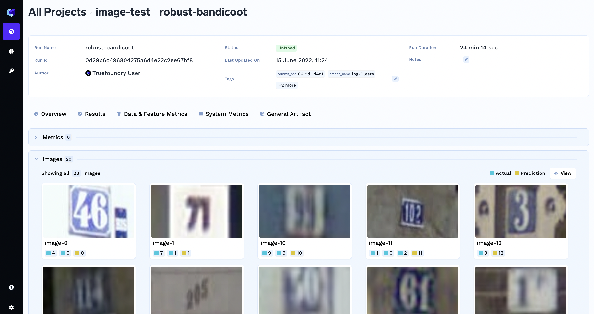
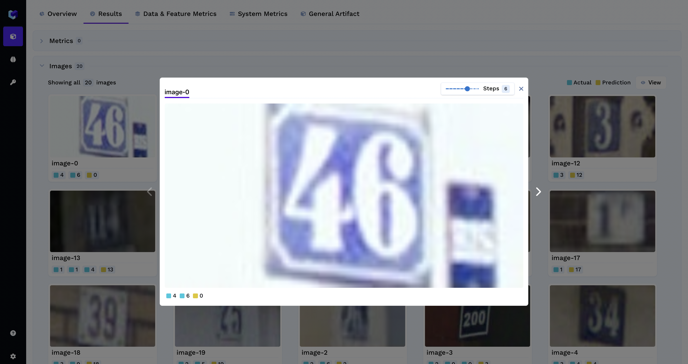
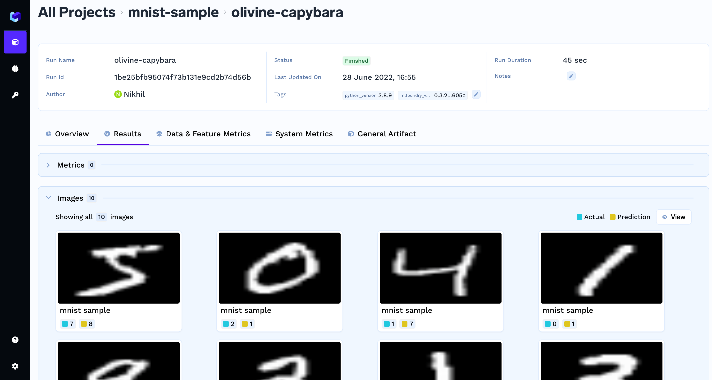

# Logging Images

### Logging images in different format

Log images under the current `run` at the given `step`.

Use the function log_images for a `run`. 
`PIL` package is needed to log images. To install the PIL package, run 
```
pip install pillow
```

Here is the sample code to log images from different sources:

```python
import mlfoundry
import numpy as np
import PIL.Image

client = mlfoundry.get_client()
run = client.create_run(
    project_name="my-classification-project",
)

imarray = np.random.randint(low=0, high=256, size=(100, 100, 3))
im = PIL.Image.fromarray(imarray.astype("uint8")).convert("RGB")
im.save("result_image.jpeg")

images_to_log = {
    "logged-image-array": mlfoundry.Image(data_or_path=imarray),
    "logged-pil-image": mlfoundry.Image(data_or_path=im),
    "logged-image-from-path": mlfoundry.Image(data_or_path="result_image.jpeg"),
}

run.log_images(images_to_log, step=1)
run.end()

```

### Visualizing the logged images

You can visualize the logged images in the MLFoundry dashboard.



You can also view the images logged step-wise by clicking in an image.




### Class `mlfoundry.Image`

Images are represented and logged using this class in mlfoundry.

You can initialize `mlfoundry.Image` by either by using a local path or you can use a numpy array / PIL.Image object.

You can also log caption and the actual and prodicted values for an image as shown in the examples below.

#### Logging images with caption and a class label 

```python
from keras.datasets import mnist
import mlfoundry as mlf
import time
import numpy as np

data = mnist.load_data()
(X_train, y_train), (X_test, y_test) = data

client = mlf.get_client()
run = client.create_run("mnist-sample")

actuals = list(y_test)
predictions = list(np.random.randint(9, size=10))

img_dict = {}
for i in range(10):
    img_dict[str(i)] = mlf.Image(
        data_or_path=X_train[i],
        caption="mnist sample",
        class_groups={
            "actuals": str(actuals[i]), 
            "predictions": str(predictions[i])
            },
    )

run.log_images(img_dict)
```
The logged images can be visualized in the mlfoundry dashboard.



#### Logging image with multi-label classification problems
```python
images_to_log = {
    "logged-image-array": mlfoundry.Image(
        data_or_path=imarray,
        caption="testing image logging",
        class_groups={"actuals": ["dog", "human"], "predictions": ["cat", "human"]},
    ),
}

run.log_images(images_to_log, step=1)
```