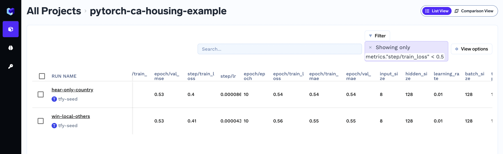
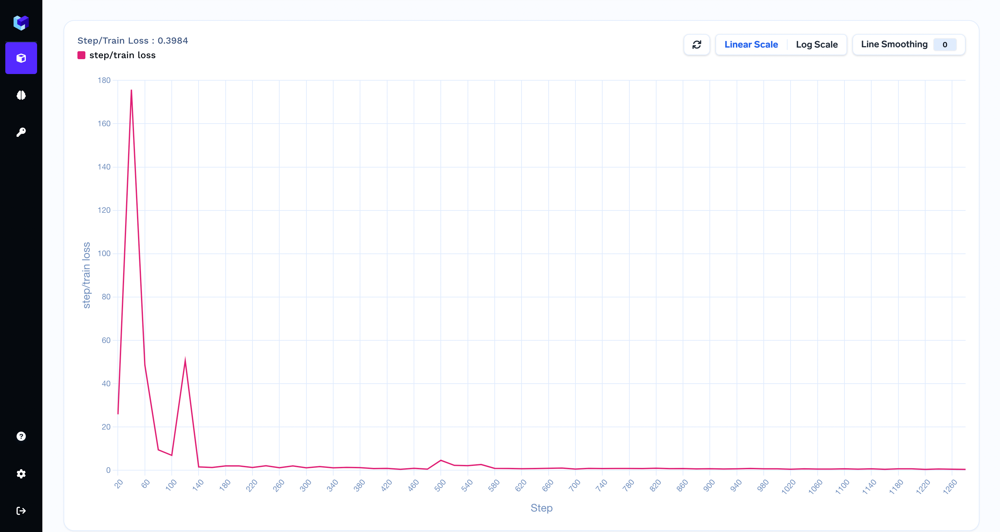

# Log Metrics over time

### Capturing metrics

You can capture metrics using the `log_metrics` method.

```python
import mlfoundry

client = mlfoundry.get_client()
run = client.create_run(project_name="sample-project")
run.log_metrics(metric_dict={"accuracy": 0.7, "loss": 0.6})

run.end()
```

These metrics can be seen in MLFoundry dashboard. Filters can be used on metrics values to filter out runs as shown in th figure. 



These metrics can also be found in the overview section of run in the dashboard.


### Step-wise metric logging

You can capture step-wise metrics too using the `step` argument.

```python
for global_step in range(1000):
    run.log_metrics(metric_dict={"accuracy": 0.7, "loss": 0.6}, step=global_step)
```
The stepwise-metrics can be visualized as graphs in the dashboard.




### Should I use epoch or global step as a value for the `step` argument?

If available you should use the global step as a value for the `step` argument.
To capture epoch-level metric aggregates, you can use the following pattern.
```python
run.log_metrics(
    metric_dict={"epoch/train_accuracy": 0.7, "epoch": epoch}, step=global_step
)
```
