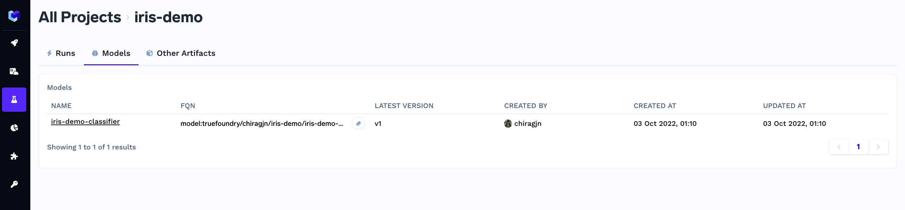
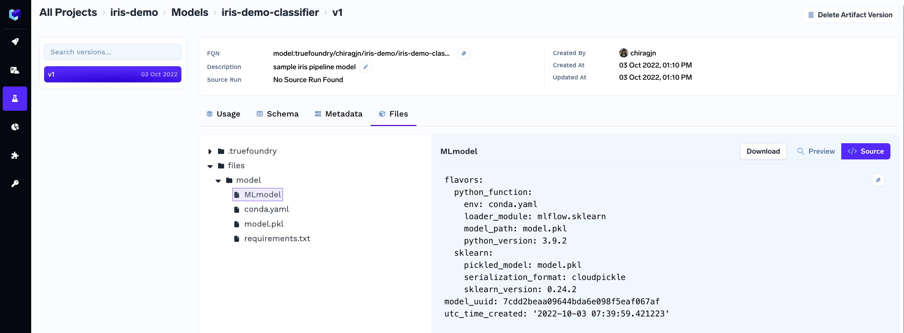

# Logging Models

You can automatically serialize, save and version model objects as using the `log_model` method.

This is an example of serializing and storing an `sklearn` model. To log a model we start a run and then give our model a `name` and pass in the model object and the `framework` name.

```python
import mlfoundry
import numpy as np
from sklearn.pipeline import make_pipeline
from sklearn.preprocessing import StandardScaler
from sklearn.svm import SVC

client = mlfoundry.get_client()
run = client.create_run(project_name="iris-demo")
X = np.array([[-1, -1], [-2, -1], [1, 1], [2, 1]])
y = np.array([1, 1, 2, 2])
clf = make_pipeline(StandardScaler(), SVC(gamma='auto'))
clf.fit(X, y)

model_version = run.log_model(
    name="iris-classifier", 
    model=clf, 
    framework="sklearn", 
    description="sample iris pipeline model",
    metadata={"accuracy": 0.99, "f1": 0.80},
    step=1,  # step number, useful when using iterative algorithms like SGD
)
print(model_version.fqn)
run.end()
```
This will create a new model `iris-demo` under the project and the first version `v1` for `iris-classifier`.  Once created the model version is immutable.

Once created, a model version has a `fqn` (fully qualified name) which can be used to retrieve the model later - E.g. `model:truefoundry/user/iris-demo/iris-classifier:1`

Any subsequent calls to `log_model` with the same `name` would create a new version of this model - `v2`, `v3` and so on.

The logged model can be found in the dashboard in the `Models` tab under your project. 



You can view the details of each model version from there on.



## FAQs

#### What are the frameworks supported by the `log_model` method?

This method supports, "sklearn", "tensorflow", "pytorch", "keras", "xgboost", "lightgbm", "fastai", "h2o", "spacy", "statsmodels", "gluon", "paddle". These options are also available as a enum - `mlfoundry.ModelFramework`

#### How can I load back a logged model?
You can first get the model using the `fqn`  and then use the `load()`  function to deserialize and load the logged model.

```python
import mlfoundry

client = mlfoundry.get_client()
model_version = client.get_model("<fqn-of-your-model>") # e.g. "model:truefoundry/user/iris-demo/iris-classifier:1"
model = model_version.load()
```

#### How can I download a logged model to disk?
You can first get the model using the `fqn`  and then use the `download()` function to download a logged model.

```python
import mlfoundry

client = mlfoundry.get_client()
model_version = client.get_model("<fqn-of-your-model>") # e.g. "model:truefoundry/user/iris-demo/iris-classifier:1"
download_info = model_version.download(path="path/to/your/location")
print(download_info)
```
From here on you can access the files at `download_info.download_dir`