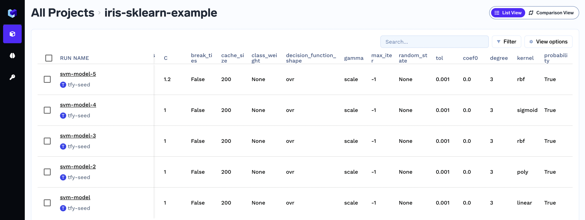
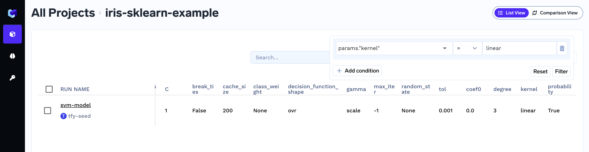

# Log Parameters

### Logging the hyperparameters
Hyperparameters are independent variables for a run used to control the learning process. We can capture the hyperparameters using the `log_params` method.
Once set, the hyperparameters are immutable. If you need to change the hyperparameter, it basically means that you are changing your model and it's best to create a new run for that. This way, the system exactly tracks the model along with the exact configuration to train it.

Note that parameter values are stringified before storing.

```python
import mlfoundry

client = mlfoundry.get_client()
run = client.create_run(project_name="iris-demo", run_name="svm-model")

run.log_params({"cache_size": 200.0, "kernel": "linear"})

run.end()
```

### Viewing logged parameter in dashboard
These logged parameters can be seen in the MLFoundry dashboard. 


### Filtering runs bases on parameter value

To filters runs, click on top right corner of the screen to apply the required filter.



### Capturing command-line arguments

We can capture command-line arguments directly from the `argparse.Namespace` object.


```python
import argparse
import mlfoundry

parser = argparse.ArgumentParser()
parser.add_argument("-batch_size", type=int, required=True)
args = parser.parse_args()

client = mlfoundry.get_client()
run = client.create_run(project_name="iris-demo")

run.log_params(args)

run.end()
```

### Can I change the param value once logged?

No you cannot change the value of param once logged.

### How can I programmatically get parameters for a run?

You can use the `get_params` method. It returns a dictionary

```python
import mlfoundry

client = mlfoundry.get_client()
run = client.get_run("run-id-of-the-run")

print(run.get_params())
```
