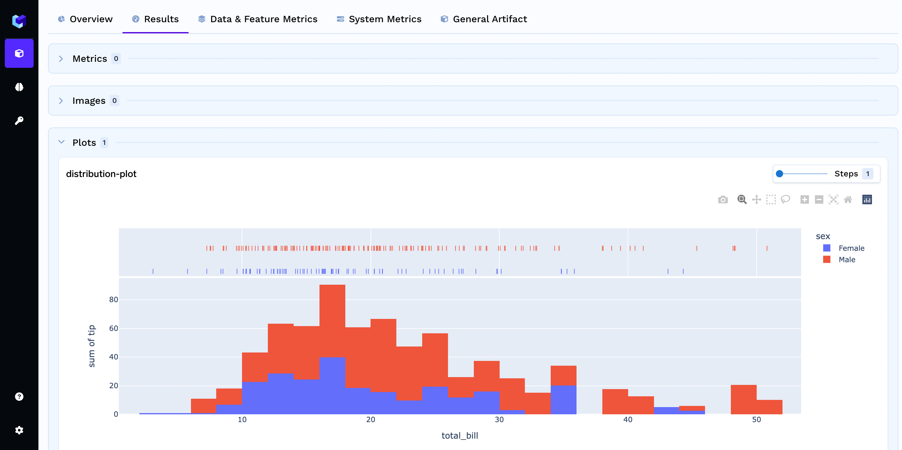

# Logging Plots

Mlfoundry allows you to log custom plots under the current `run` at the given `step` using the `log_plot` function.
You can use this function to log custom matplotlib, plotly plots as shown in examples below:

```python
import mlfoundry
from sklearn.metrics import ConfusionMatrixDisplay
import matplotlib.pyplot as plt

client = mlfoundry.get_client()
run = client.create_run(
    project_name="my-classification-project",
)

ConfusionMatrixDisplay.from_predictions(["spam", "ham"], ["ham", "ham"])

run.log_plots({"confusion_matrix": plt}, step=1)
```

You can visualize the logged plots in the Mlfoundry Dashboard.


### Logging a seaborn plot

```python
import mlfoundry
from matplotlib import pyplot as plt
import seaborn as sns

# create a run in mlfoundry
client = mlfoundry.get_client()
run = client.create_run(
    project_name="my-classification-project",
)

sns.set_theme(style="ticks", palette="pastel")

# Load the example tips dataset
tips = sns.load_dataset("tips")

# Draw a nested boxplot to show bills by day and time
sns.boxplot(x="day", y="total_bill", hue="smoker", palette=["m", "g"], data=tips)
sns.despine(offset=10, trim=True)

run.log_plots({"seaborn": plt})

run.end()
```

### Logging a plotly figure
```python
import mlfoundry
import plotly.express as px

client = mlfoundry.get_client()
run = client.create_run(project_name="my-classification-project")

df = px.data.tips()
fig = px.histogram(
    df,
    x="total_bill",
    y="tip",
    color="sex",
    marginal="rug",
    hover_data=df.columns,
)

plots_to_log = {
    "distribution-plot": fig,
}

run.log_plots(plots_to_log, step=1)
run.end()
```
You can find this logged image in the dashboard.


