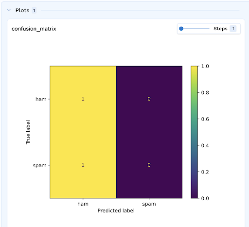

# Logging Plots

Mlfoundry allows you to log custom plots under the current `run` at the given `step` using the log_plot() function.
You can use this function to log custom matplotlib, plotly plots.

### Logging a plotly figure
```python
import mlfoundry
import plotly.express as px

client = mlfoundry.get_client()
run = client.create_run(
    project_name="my-classification-project",
)

df = px.data.tips()
fig = px.histogram(
    df,
    x="total_bill",
    y="tip",
    color="sex",
    marginal="rug",
    hover_data=df.columns,
)

plots_to_log = {
    "distribution-plot": fig,
}

run.log_plots(plots_to_log, step=1)
run.end()
```

### Logging a matplotlib plt or figure
```python
import mlfoundry
from matplotlib import pyplot as plt
import numpy as np

client = mlfoundry.get_client()
run = client.create_run(
    project_name="my-classification-project",
)

t = np.arange(0.0, 5.0, 0.01)
s = np.cos(2 * np.pi * t)
(line,) = plt.plot(t, s, lw=2)

plt.annotate(
    "local max",
    xy=(2, 1),
    xytext=(3, 1.5),
    arrowprops=dict(facecolor="black", shrink=0.05),
)

plt.ylim(-2, 2)

plots_to_log = {"cos-plot": plt, "cos-plot-using-figure": plt.gcf()}

run.log_plots(plots_to_log, step=1)
run.end()
```

### Visualizing the Logged Plots
You can visualize the logged plots in the Mlfoundry Dashboard.


