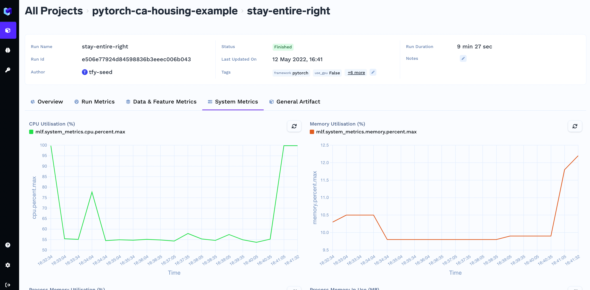

# Logging and Visualizing System Metrcis

MLFoundry automatically logs the system metrics like CPU usage and memory as soon as you start a run.

You can visualize these metrics corresponsing to a run in the dashboard.

