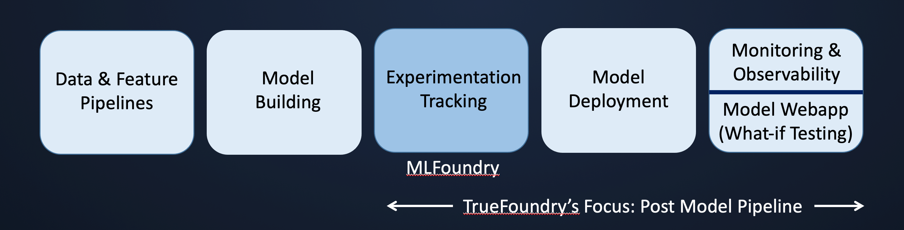

TrueFoundry is building a platform to optimize the post-model pipeline- allowing users to go live from experimentation to production in less than 15 minutes while following the best engineering practices like monitoring, auto-scaling, versioning & reproducibility. 

To achieve versioning and reproducibility of the models, TrueFoundry has built an Experiment Tracking framework that allows users to track and compare experiments by just adding a few lines of code. Our client-side library, MLFoundry, allows you to log your experiments, models, metrics, data, features & predictions. Our interactive & intuitive dashboards makes it easy to visualize, compare & share your experiments. 