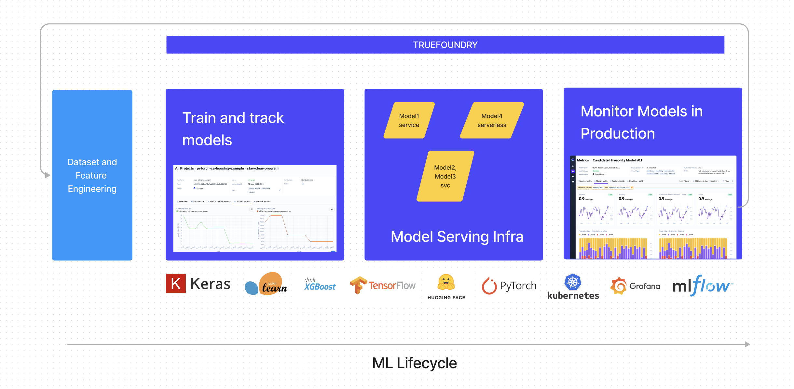

# Introduction

TrueFoundry is a platform that makes training, deploying and monitoring models very easy for both individuals and companies. 

TrueFoundry comes with experiment tracking, model deployment and monitoring - all at one place so that data scientists don't need to juggle between different tools and can have high levels of flexibility and independence to deploy their models with best practices and policies.

Currently, there is lot of interdependence between the data science, data engineering and DevOps teams which leads to delays in implementation and development. We experienced the problem first-hand and have been working on inverting the flow to make production times for ML models much faster. 

## What is TrueFoundry?

TrueFoundry provides a single platform to log and track your experiments and models, deploy them in whatever configuration you want and then monitor their performance. The key components are:

1. **Track your experiments and models**: TrueFoundry's [tracking library](./experiment-tracking/overview.md) called `mlfoundry` builds on top of the popular open source library MLFlow. We fixed a lot of the current issues in MLFlow - added authentication, a more intuitive UI, logging custom datatypes support while retaining the core APIs.

2. **Deploy Your models**: TrueFoundry's deployment library is called `servicefoundry` and [makes it super easy](./deployment/README.md) to deploy models on managed Kubernetes clusters. Since we build on top of Kubernetes, it provides complete flexibilty to add any integrations that come with Kubernetes. 

3. **Monitor your models**: With TrueFoundry, you can generate dashboards with various model monitoring metrics automatically like feature value distributions, model performance statistics, drifts etc just by adding a few log lines into your code. Data scientists can also add custom metrics and create alerts on their models.

4. **Demo your models (COMING SOON)**: Data scientists are often required to demo models to product managers or early users to collect feedback. Building a frontend app requires learning frontend frameworks like React/Vue/Angular. However we make it very easy to demo models by writing only simple Python code.

5. **Run end to end pipelines (In the roadmap)**: We are also working on providing support for running end-to-end pipelines using KubeFlow, Metaflow and a few other frameworks.

## TrueFoundry Public Cloud
TrueFoundry is hosted as a public cloud for data scientists to try it out and host their models. The public cloud provides a multitenant system for experiment tracking, model deployment and monitoring. You get a free tier to run 1 model end to end with limited resources. However, you can purchase additional resources to run more heavy or multiple models. 

Our public cloud is still in alpha - so we don't recommend it for any production usecases yet. However, feel free to try out your hobby or test projects for faster iteration times and give us feedback. This will help us in making the platform much better.

## Try out TrueFoundry!
You can try TrueFoundry for your own personal usecase [here](https://app.truefoundry.com/). 

You can also deploy TrueFoundry on your own cloud to provide the same developer experience to all ML teams. To host TrueFoundry on your own cloud, please get in touch with us. As of now, we work well with the AWS ecosystem - but we do plan to extend support to other cloud providers.