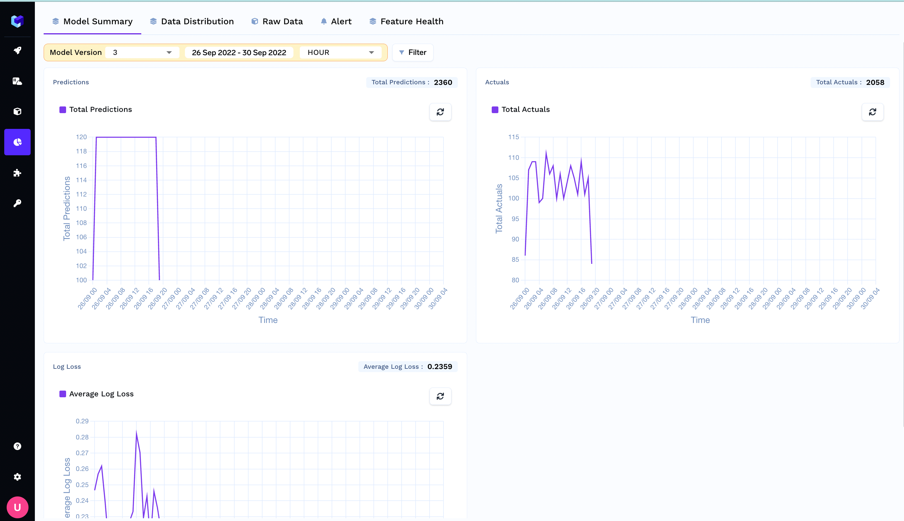
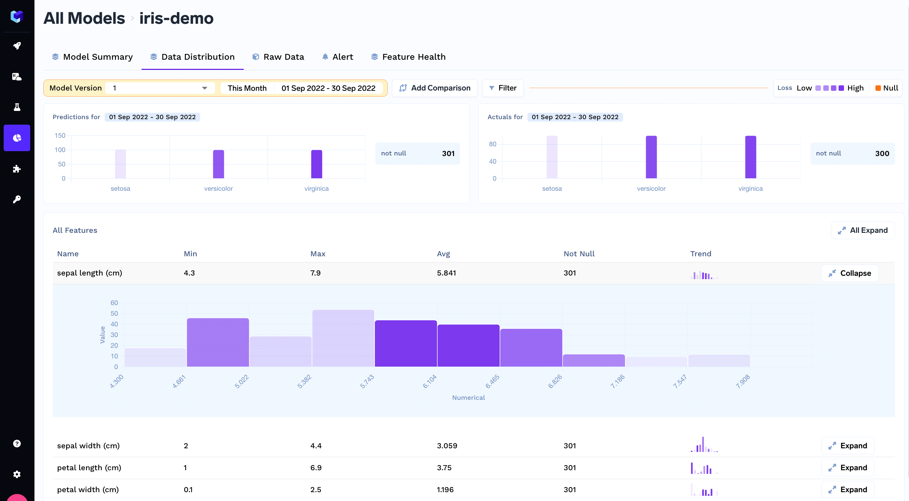
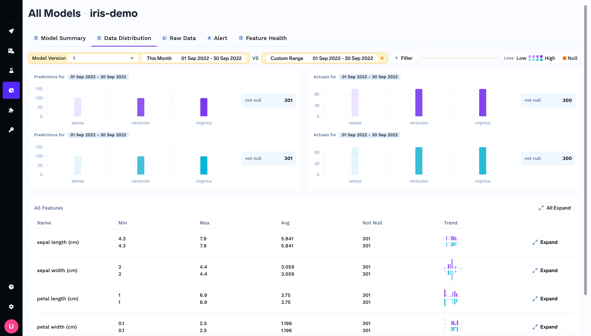
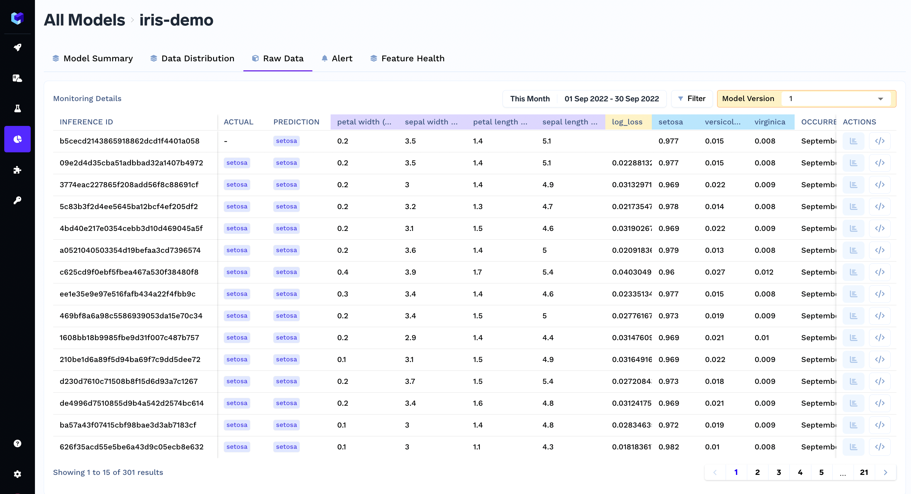
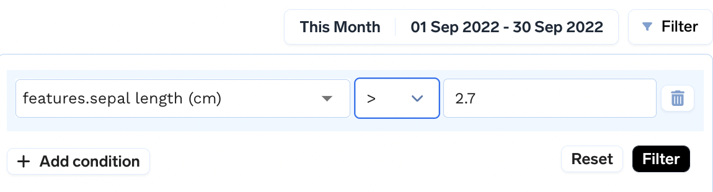

# Visualizing the Logged Data

Users can visualize the logged data in the `Data Monitoring` section of the dashboard.

This dashboard generates all the graphs corresponding to a model version which can be selected from a dropdown.

The Dashboard has three sections:

### Model Summary
This section consists of timeseries graph of the prediction volumes, actual volume and custom-metrics graph. Here is how it looks in the dashboard.

### Data Distribution
This section displays the distribution of features, predictions and actual for a given time range.

It plots the following graphs for features/predictions:
* Categorical: A histogram representing counts corresponding to each class.
* Numeric: A histogram with 10 buckets from minimum to maximum. Each bar representing the number of feature/prediction lying in that bucket.

**Note**: Each bar of histogram is color coded with a light color denoting a low `custom_metric` value which is the defined `loss function`. This can provide an insight that for what prediction value, feature value the model is not performing well.

You can also add comparison between two time windows:

### Raw Data
This is the dataset browser, where user can browse through the dataset.

### Applying Filters
Filters can be applied on features, predictions, actuals and custom metric values on all three pages.

