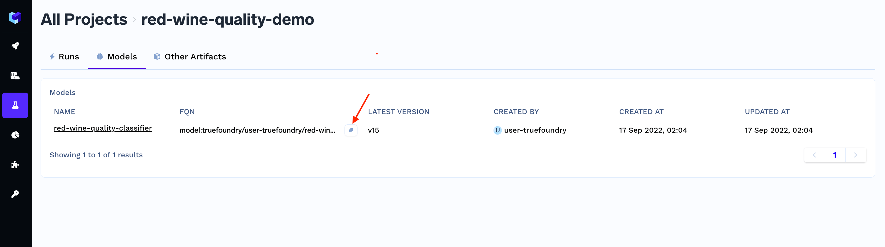
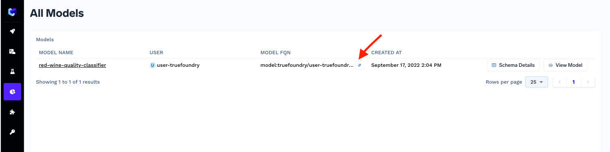

# Fetching Inference Data

This section describes how a user can fetch the inference data with a python API which can be used to re-train the model on real time data.

For example, user can download the the inference data of past one month in which actual values are also logged with the following API.

```python
import mlfoundry as mlf

client = mlf.get_client()

inference_data = client.get_inference_dataset(
    model_fqn="",
    start_time=datetime.now() - timedelta(days=30),
    end_time=datetime.now(),
    actual_value_required=True,
)

```

### How to get the `model_fqn`?
All models can be found in the experimentation tracking section of Truefoundry's dashboard. Go to the [dashboard](https://app.truefoundry.com/mlfoundry) and click on the project and navigate to the models section.



The models which have monitoring enabled can be found in the monitoring dashboard.



### Response stucture of `get_inference_dataset`
The returned object `inference_data` is of class `GetDatasetResponse` defined below:

```python
class GetDatasetResponse(BaseModel):
    total_rows: int
    data: List[DatasetData]

class DatasetData(BaseModel):
    data_id: str
    features: Dict[str, Union[int, float, str]]
    actual: Dict[str, Union[int, float, str]]
    raw_data: Dict
    created_at: datetime
```

**Note**: If `start_time` and `end_time` passed by user are not timezone aware, then timezone is considered to be `UTC` by default.

### Using the inference data for retraining

The returned inference data can be used for offline analysis, EDA or simply retraining the model on this new data.

Here is an example:
```python
# load the initial dataset
X_train, y_train, X_test, y_test = load_initial_dataset()

# fetch the inference dataset for last 7 days where actuals were also logged
client = mlf.get_client()
inference_data = client.get_inference_dataset(
    model_fqn=model_fqn,
    start_time=datetime.now(timezone.utc) - timedelta(days=7),
    actual_value_required=True,
)

# append the inference dataset to the train dataset
X_train.append([data.features for data in inference_data], ignore_index=True)
y_train.append(
    pd.Series([int(data.actual["value"]) for data in inference_data]),
    ignore_index=True,
)

# retrain the model
model = train_script(X_train, y_train, X_test, y_test)
```
