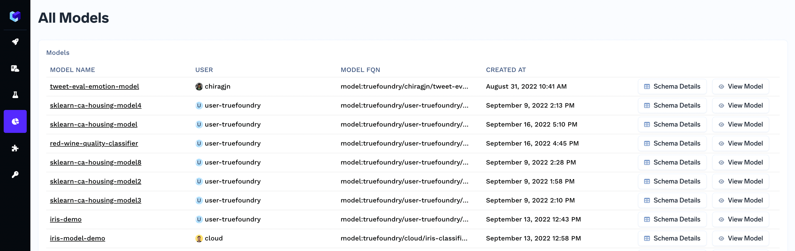

# Getting Started

## Installation
You need to install Mlfoundry library in order to get started with monitoring. Click [here](../experiment-tracking/getting-started/setup.md) to view the steps to setup the library.

## Quick Start

Lets us consider a simple sklearn model trained on iris dataset to get started with monitoring. 

### Creating a simple sklearn model
```python
import pandas as pd
import numpy as np
import mlfoundry as mlf
from sklearn import datasets
from sklearn import svm
from sklearn.model_selection import train_test_split

iris = datasets.load_iris()
iris_frame = pd.DataFrame(iris.data, columns = iris.feature_names)
X = iris.data
y = np.array([iris.target_names[i] for i in iris.target])

X_train, X_test, y_train, y_test = train_test_split(X, y, test_size=0.2)

# Model Training
clf = svm.SVC(gamma='scale', kernel='rbf', probability=True)
clf.fit(X, y)

prediction_probabilities = list(clf.predict_proba(X))
prediction = list(clf.predict(X))
```

### Logging the Model and the schema

Let us log the model, along with model schema and define the desired custom metrics.

```python
client = mlf.get_client()
run = client.create_run(project_name="iris-demo")

model_version = run.log_model(
    name="iris-sklearn",
    model=clf,
    framework="sklearn",
    description="sklearn model, rbf kernel",
    model_schema={
        "features": [
            {"name": "sepal length (cm)", "type": "float"}, 
            {"name": "sepal width (cm)", "type": "float"},
            {"name": "petal length (cm)", "type": "float"},
            {"name": "petal width (cm)", "type": "float"}
        ],
        "prediction": "categorical"
    },
    custom_metrics=[{
        "name": "log_loss", 
        "type": "metric",
        "value_type": "float"
    }],
)
```

### Logging the predictions and actuals

```python
from datetime import datetime

for i in range(150):
    
    features = { 
        iris.feature_names[j]: float(X[i][j]) for j in range(4)
    }
    
    prediction_data = {
        "value": prediction[i],
        "probabilities": {
            iris.target_names[j]: float(prediction_probabilities[i][j]) 
            for j in range(3)
        },
        "shap_values": {}
    }
    id = client.generate_hash_from_data(
        features=features,
        timestamp = datetime.utcnow()
    )
    client.log_predictions(
        model_version_fqn = model_version.fqn,
        predictions = [
            mlf.Prediction(
                data_id=id,
                features=features,
                prediction_data = prediction_data,
                raw_data = {},
            )
        ]
            
    )
   
    client.log_actuals(
        model_version_fqn = model_version.fqn,
        actuals = [
            mlf.Actual(data_id=id, value=y[i])
        ]
    )
```

And with these log-lines, truefoundry generates monitoring dashboards for your models. You can open the monitoring dashboard with by clicking on this [link](https://app.truefoundry.com/data-monitoring).



