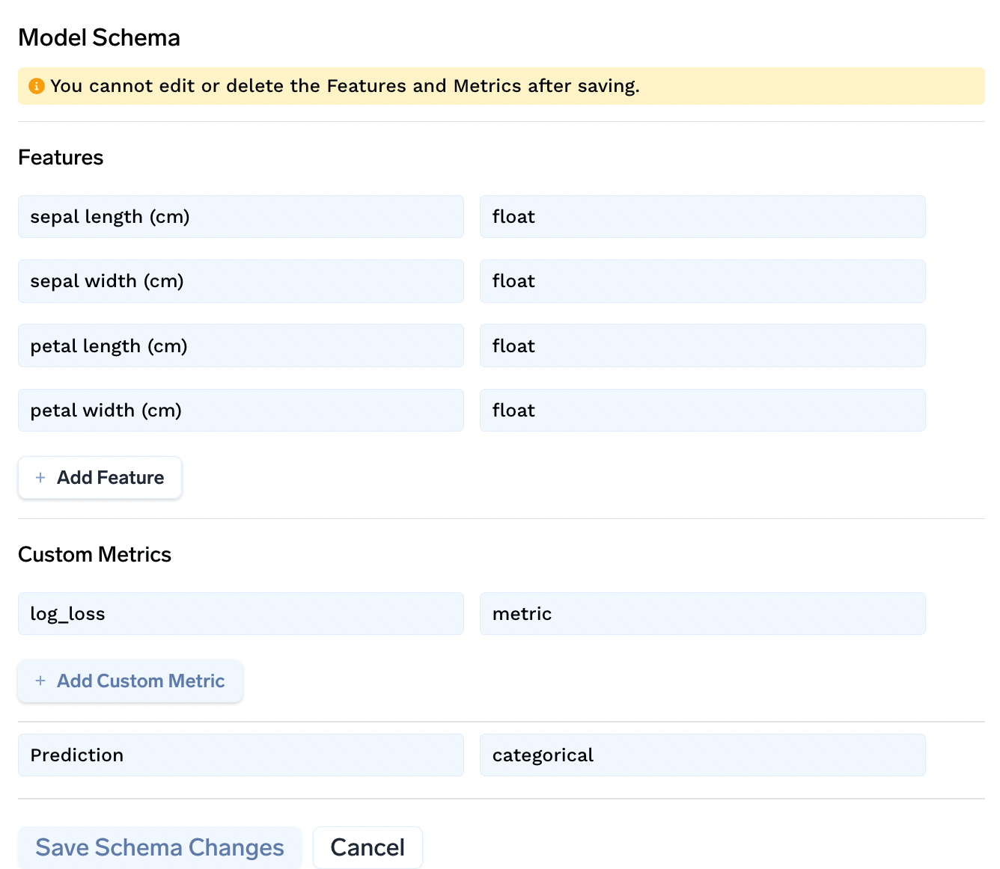

# Defining the Model Schema

Model schema and custom metrics for a Machine Learning Model can be defined at the time of logging the model.

```python
client = mlfoundry.get_client()
run = client.create_run(project_name="project_name")

model_version = run.log_model(
    name="demo-model",
    model=model,
    framework="sklearn",
    description="model description",
    model_schema={
        "features": [
            {"name": "feature1", "type": "float"},
            {"name": "feature2", "type": "string"},
        ],
        "prediction_type": "categorical",
    },
    custom_metrics=[{"name": "log_loss", "type": "metric", "value_type": "float"}],
)
```

The schema can also be viewed and edited from the [monitoring dashboard](https://app.truefoundry.com/data-monitoring) by clicking on view schema button:

