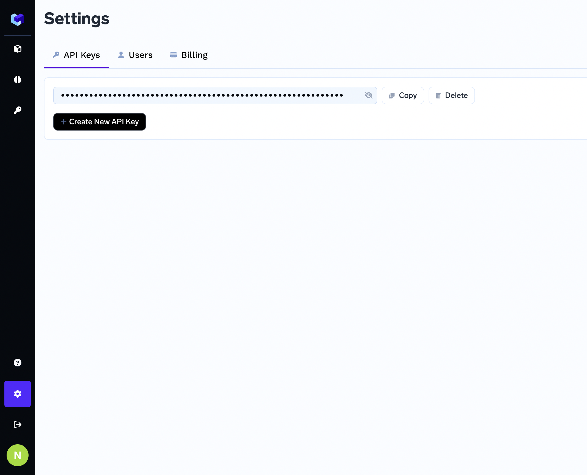
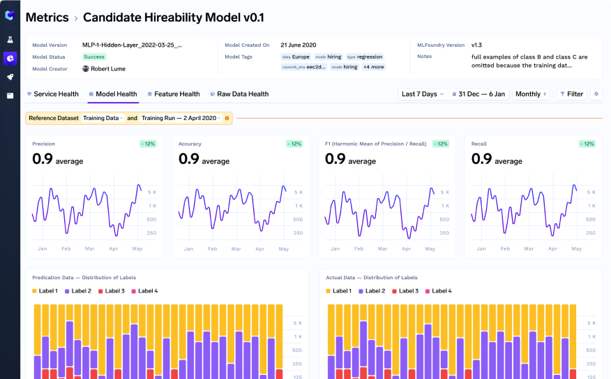
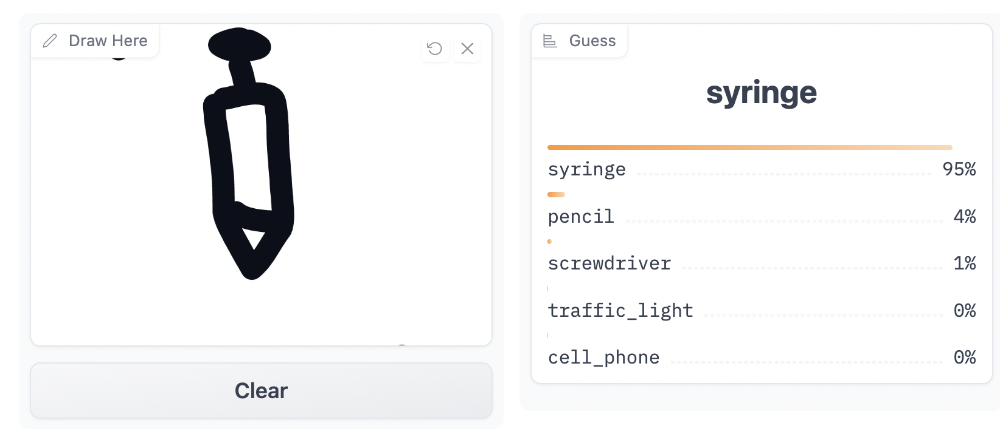

# Quick Start

## 1. Track Your Experiments
Make your models reproducible by logging metrics, data and models.
### 1.  **Get API Key:** Login to the our [website](https://app.truefoundry.com/settings) to obtain an api key.

    

### 2. **Install MLFoundry:** Run the following command to install MLFoundry.

    ```
    pip install mlfoundry
    ```

### 3. **Inject Log Lines in your training script:**

    ```python
    import pandas as pd
    import numpy as np
    import sklearn
    from sklearn import datasets, model_selection, svm, metrics
    import mlfoundry as mlf

    mlf_api = mlf.get_client(tracking_uri="SERVER_URI", api_key="REPLACE_YOUR_API_KEY")
    mlf_run = mlf_api.create_run(project_name='iris-demo', run_name='svm-model')

    # Load and Prep Data
    iris = sklearn.datasets.load_iris()
    X_train, X_test, y_train, y_test = sklearn.model_selection.train_test_split(iris.data,  iris.target, test_size=0.2)
    mlf_run.log_dataset(features=pd.DataFrame(X_train), dataset_name="train")

    # Model Training
    clf = sklearn.svm.SVC(gamma='scale', kernel='rbf', probability=True)
    clf.fit(X_train, y_train)
    mlf_run.log_model(clf, "sklearn")

    # Compute Metrics
    y_hat_test, metrics_dict = clf.predict(X_test), {}
    metrics_dict['accuracy_score'] = sklearn.metrics.accuracy_score(y_test, y_hat_test)
    mlf_run.log_metrics(metrics_dict)
    mlf_run.log_params(clf.get_params())
    ```

### 4. ***View logged data in dashboard:*** Click [here](https://app.truefoundry.com/mlfoundry) to view your MlFoundry Dashboard

    

## 2. Deploy your Model (Coming Soon)
Make your models reproducible by logging metrics, data and models.

### 1. **Install Servicefoundry:**
Run the following command to install ServiceFoundry.

    ```
    pip install servicefoundry
    ```

### 2. **Write Service code:** A predict function for the model needs to defined as shown below.

    ```python
    import pandas as pd
    import mlfoundry as mlf

    mlf_api = mlf.get_client(tracking_uri="SERVER_URI", api_key="REPLACE_YOUR_API_KEY")
    mlf_run = mlf_api.load_run(RUN_ID)

    @app('iris/predict')
    def predict(data)
        model = mlf_api.load_model('model_name')
        features = pd.DataFrame(data)
        prediction = model.predict(features)
        return prediction
    ```

### 3. **Deploy your service:** Run the following command

    ```
    servicefoundry deploy
    ```

## 3. Monitor in production (Coming Soon)
Monitor your models (batch and realtime) for prediction drift, accuracy, feature and data drift.

### 1. **Add log lines to your inference function:** 

    ```python
    import pandas as pd
    import mlfoundry as mlf
    mlf_api = mlf.get_client(api_key="REPLACE_YOUR_API_KEY")
    mlf_run = mlf_api.load_run(RUN_ID)
    @app('iris/predict')
    def predict(data)
        model = mlf_api.load_model('model_name')
        features = pd.DataFrame(data)
        prediction = model.predict(features)
        # If you don’t pass the prediction_id the system will generate one for you to reference actuals later
        mlf_run.log_prediction(features, prediction, prediction_id=YOUR_UNIQUE_ID)
        return prediction
    # This code can be logged from anywhere in your codebase
    actual_val = some_val
    mlf_run.log_actual(actual_val, prediction_id)
    ```

### 2. **View Model Monitoring Metrics:**


    
## 4. Showcase your model 
Share a demo of your model with streamlit UI
### 1. **One Line of Code to generate the UI:** 

    ```python
    import pandas as pd
    import mlfoundry as mlf

    mlf_api = mlf.get_client(tracking_uri="SERVER_URI", api_key="REPLACE_YOUR_API_KEY")
    mlf_run = mlf_api.load_run(RUN_ID)

    @app('iris/predict')
    def predict(data)
        model = mlf_api.load_model('model_name')
        features = pd.DataFrame(data)
        prediction = model.predict(features)
        return prediction

    # Add this line to generate the webapp
    # Generic streamlit code- maybe to collect feedback for prediction, or building a model feedback tool.
    mlf.webapp(predict, inputs=[number,number,number,number], outputs=[text])
    ```

### 2. **Deploy and share your model:** 

    
